# Zotero pour les revues de littérature

## Objectifs

* Créer et organiser une bibliothèque Zotero dédiée pour une revue de littérature
* Tirer parti des fonctionnalités de Zotero et de ses extensions à toutes les étapes d’une revue de littérature, de l’import par lot des références bibliographiques à l’analyse du corpus et à la restitution des résultats

## Sommaire

0. Tour de table 
1. Introduction sur les revues de littérature : synthèses de la littérature, revues narratives et revues systématiques
2. Organiser le flux de travail bibliographique d'une revue de littérature avec Zotero
3. Les outils de Zotero au service du travail d’analyse d’une revue de littérature
4. Rendre compte des résultats d’une revue de littérature

## 0. Tour de table

1. A quelle université ou organisation appartenez-vous? Quel est votre domaine de recherche?
2. Quelles sont vos attentes pour le stage?

## 1. Introduction sur les revues de littérature 

Une revue de littérature peut prendre plusieurs formes, selon le cadre de la recherche et le livrable attendu. Dans ce spectre, il est possible de naviguer entre différentes options, de la revue narrative à la revue systématique, comme le montre le tableau non exhaustif ci-dessous.

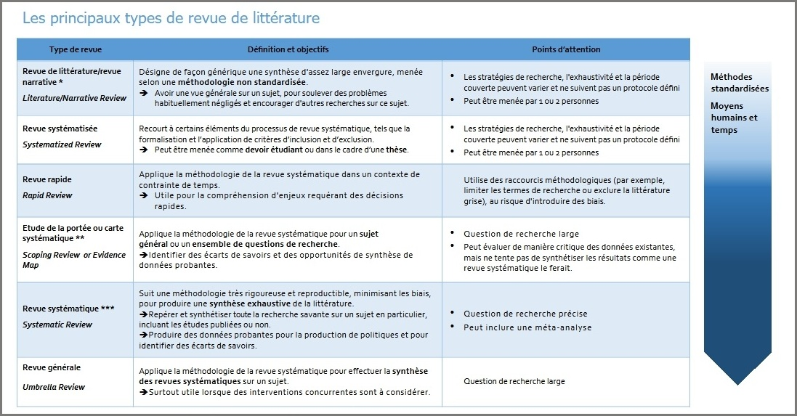

[Télécharger le tableau en ligne au format PDF aux dimensions A4](https://github.com/fflamerie/intro_revlit/blob/main/docs/Typologie_RevLit.pdf)

Dans tous les cas, y compris pour une synthèse de littérature menée dans le cadre d’un travail universitaire, Zotero peut grandement faciliter la réalisation de votre revue, accompagnant votre méthodologie quel que soit le degré d’exhaustivité que vous souhaitez ou devez atteindre.

## 2. Organiser le flux de travail bibliographique d'une revue de littérature avec Zotero

### 2.1 Créer une bibliothèque de groupe

Même si vous travaillez seul, il est préférable de créer une bibliothèque de groupe pour votre revue de littérature, cela facilitera notamment **la gestion des doublons**. La recherche de doublons s'exécute en effet toujours sur tout le contenu d'une bibliothèque, il n'est pas possible de la lancer seulement sur une partie de votre bibliothèque (une collection par exemple).

Le groupe Zotero consiste de plus en un **espace à part** distinct de votre bibliothèque personnelle : lorsque vous ajoutez un document depuis votre bibliothèque personnelle dans une bibliothèque de groupe, il est copié de votre bibliothèque vers cette bibliothèque de groupe. Si vous modifiez ce même document dans votre bibliothèque personnelle, les modifications ne sont pas répercutées dans la bibliothèque de groupe, et inversement. Vous distinguez ainsi nettement votre travail bibliographique personnel courant du travail bibliographique effectué pour votre revue de littérature. Il est bien sûr possible d’enregistrer un document directement dans la bibliothèque de groupe, sans effectuer de détour par votre bibliothèque personnelle.

Le groupe Zotero permet par ailleurs de définir très précisément qui a le droit de consulter ou modifier la bibliothèque de groupe, grâce à la combinaison des paramétrages suivants.

* Le **type de groupe** : privé, public à participation restreinte ou public à participation ouverte
* Les **membres du groupe** : rôle de membre, d’administrateur ou de propriétaire
* Les **droits accordés sur la bibliothèque** : lecture de la bibliothèque, modification des documents de la bibliothèque, modification des fichiers

Vous pouvez ainsi être le seul contributeur d’un groupe dont la bibliothèque peut être consultée plus largement, par les membres du groupe ou par tout internaute.

#### Points d'attention concernant la synchronisation et les groupes

* Le **quota de 300 Mo** d’espace de stockage gratuit sur le serveur Zotero concerne les **fichiers joints** et non les références bibliographiques, ni les notes et annotations : si vous ne synchronisez pas vos fichiers joints vous n’aurez aucun problème de dépassement de votre espace de stockage. Pour les bibliothèques de groupe, l'espace de stockage est décompté sur le quota du **propriétaire du groupe**.
* Le compte en ligne vous permet d’**enregistrer des documents directement dans votre bibliothèque en ligne**. Vous pouvez ainsi ajouter des documents dans votre bibliothèque Zotero même si Zotero n’est pas installé sur l’ordinateur que vous utilisez. Il faut en revanche que le connecteur Zotero soit installé dans le navigateur que vous utilisez, ou que vous ayez recours à l'ajout par identifiant.
* Vous retrouvez dans votre bibliothèque en ligne une petite partie des fonctionnalités de votre bibliothèque locale. A noter que l'application locale est indispensable pour l'interaction avec **les extensions de traitement de texte**.
* Si le droit de consulter la bibliothèque de groupe peut être accordé à tout internaute, **cette consultation est limitée aux références bibliographiques** : les fichiers joints demeurent toujours accessibles seulement aux membres du groupe.
* Veillez à **la bonne attribution des droits** en fonction de l’organisation souhaitée. Par exemple, si les droits des membres du groupe sont limités à la seule consultation de la bibliothèque, n’oubliez pas d’attribuer le rôle d’administrateur à toutes les personnes qui doivent ajouter des documents dans la bibliothèque ou les modifier.
* Pour faciliter l'ajout des membres du groupe au démarrage d'un projet, il est recommandé de créer un groupe de type **Public, à participation restreinte** plutôt qu'un groupe privé. L'initiative de rejoindre le groupe revient ainsi aux membres et non aux administrateurs du groupe, qui se voient épargnés la collecte des noms d'utilisateur Zotero ou des adresses de courriel pour l'envoi des invitations. Dans le cas d'un groupe destiné à devenir privé, il suffit alors de modifier ce paramètre lorsque tous les membres ont rejoint le groupe.
* Un **flux RSS** affiché sur la page de la bibliothèque en ligne du groupe permet de suivre les ajouts dans la bibliothèque. Il faut pour cela que le groupe soit public, et sa bibliothèque consultable par tous.

📝 Quel type de groupe créez-vous pour votre projet de revue de littérature? Quels paramétrages vous semblent-ils nécessaires?

### 2.2 Importer des lots de références dans Zotero
Recourir au connecteur de Zotero et cliquer sur le bouton "Save to Zotero" est la meilleure méthode pour enregistrer des documents dans votre bibliothèque au fil des recherches, lorsqu'il s'agit d'enregistrer un document après l'autre.

Dans le cadre d'une revue de littérature où vous devez enregistrer d'un seul coup depuis une base de données tous les résultats d'une équation de recherche, l'import de fichier est plus adapté, car beaucoup plus rapide.

Nous allons effectuer ensemble des tests sur quelques bases de données ou moteurs de recherche. La méthode peut être généralisée de la façon suivante.

1. Rechercher dans l'interface, sur la page d'une liste de résultats, une fonctionnalité intitulée _Save_, _Export_, _Downolad_ ou un équivalent du même registre.
2. Vérifier les **formats d'export disponibles** : s'il y en a plusieurs, effectuer des tests d'export et d'import dans Zotero pour chacun d'eux avec un lot restreint de résultats. Cela permet de sélectionner le format le plus adapté, c'est-à-dire qui à la fois soit pris en charge par Zotero et comporte les données les plus complètes et les mieux formatées. Dans PubMed par exemple, c'est le format **.nbib**.  
3. Anticiper dès cette étape les limitations qui pourraient ralentir ou compliquer votre travail, telles qu'un **nombre maximal de références par lot exporté**.

#### Importer par lot : exemples pratiques 

📝 Effectuez une recherche ramenant au moins 200 résultats dans chacun des outils de recherche bibliographiques ci-dessous. Quelle est la meilleure méthode d'export, pour importer tous les résultats de votre recherche dans Zotero?

1. **[GreenFile](http://www.greeninfoonline.com/)** : si votre université est abonnée à une base de données sur EBSCOHost, vous pouvez faire le test sur cette base de données plutôt que sur GreenFile
2. **[CAIRN Info](https://shs.cairn.info/?lang=fr)**
3. **[CORE](https://core.ac.uk/)**

#### Google Scholar : le détour par Publish or Perish

Parmi les nombreuses limitations imposées par Google Scholar, figurent celle du nombre de résultats affichés et exportables, et celle des fréquents refus de service pour usage abusif.

L'utilisation combinée du logiciel **[Publish or Perish](https://harzing.com/resources/publish-or-perish)** et d'un **VPN** permettent de contourner en partie ces obstacles et d'exporter d'un seul coup jusqu'à 1'000 résultats, dans divers formats y compris les formats RIS et BibTex.

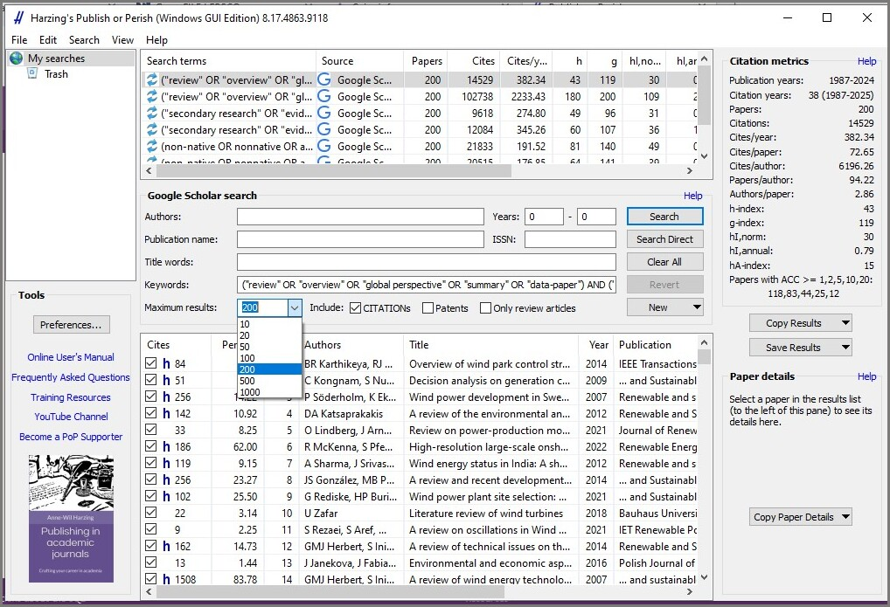

Notez que Publish or Perish permet d'interroger d'autres sources, y compris des sources soumises à abonnement comme **Scopus**. Pour Scopus l'interrogation est gratuite jusqu'à 200 références et nécessite de disposer d'un compte gratuit Elsevier.

### 2.3 Gérer les doublons avec l'extension Zoplicate

Lorsque vous affichez les doublons potentiels repérés par Zotero en cliquant sur la vue "Doublons", vous devez ensuite valider individuellement chaque doublon pour fusionner les enregistrements concurrents. Ce fonctionnement est optimal pour **éviter les faux positifs**, c'est-à-dire pour éviter de fusionner des documents proposés comme doublons potentiels mais qui ne sont pas des doublons. Cela peut toutefois être pénalisant à certaines étapes d'une revue de littérature, lorsque ce risque de faux positif est nul. Par ailleurs, l'extension [Zoplicate](https://github.com/ChenglongMa/zoplicate) offre d'autres fonctionnalités intéressantes en plus de la fusion des doublons par lot.

#### Installer et configurer une extension

L’installation d’une extension dans Zotero consiste à charger dans Zotero un fichier d’un format particulier, le format `.xpi`. Voici les étapes à suivre.

* Enregistrer sur son ordinateur le fichier `.xpi` mis à disposition sur le site de l'extension que l’on souhaite installer.
* Dans Zotero, aller dans le menu _Outils_ > _Extensions_.
* Cliquer sur la roue dentée et choisir _Install Plugin From File_.
* Sélectionner et charger le fichier `.xpi`.

Il faut le plus souvent redémarrer Zotero pour finaliser l’installation.


Les extensions sont généralement distribuées par le biais d'un dépôt Git en ligne.

Sur GitHub, on trouve le plus souvent le fichier d'installation `.xpi` sur la page _Releases_, accessible depuis la page principale du dépôt comme illustré ci-dessous. Une fois sur cette page, il convient de choisir la version la plus adaptée, en général il s'agit de la dernière.

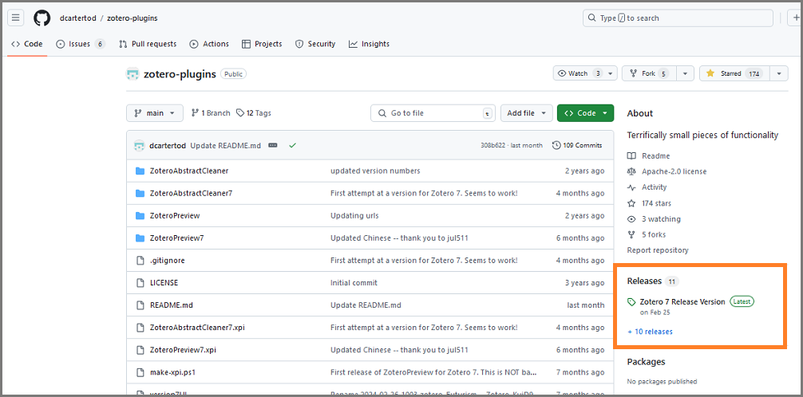

🛠️ Téléchargez et installez les extensions que nous allons voir au cours de la formation.

* [Zoplicate](https://github.com/ChenglongMa/zoplicate)
* [Linter](https://github.com/northword/zotero-format-metadata)
* [Actions & Tags](https://github.com/windingwind/zotero-actions-tags)

#### Zoplicate

Zoplicate optimise la gestion des doublons grâce aux fonctionnalités suivantes, qui peuvent être utilisées de façon combinée ou dissociée.

* **Détection des doublons à l'import et choix de la décision à appliquer** : conserver les deux documents, les fusionner et choisir le document existant comme document maître, les fusionner et choisir le document importé comme document maître, demander pour chaque cas.
* **Fusion par lot des doublons et paramétrage du document maître** : utiliser comme document maître le document le plus ancien, le plus récent, le document modifié le plus récemment, le plus détaillé.
* **Affichage du nombre de doublons** dans le volet de gauche de Zotero.
* Marquage des faux positifs comme **"non doublons"**, ce qui les fait disparaître de la vue "Doublons".

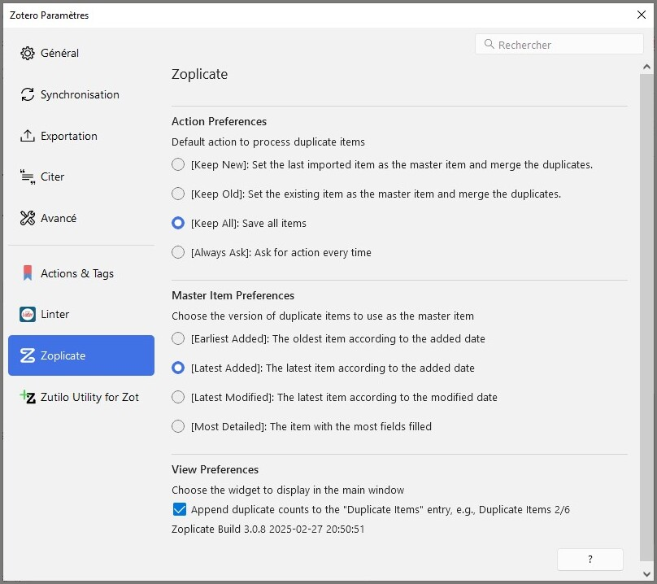

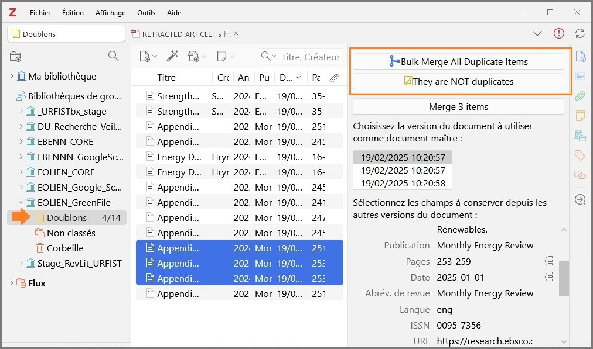

📝 Importez le fichier **test_zoplicate.bib** dans Zotero. Quels paramétrages et fonctionnalités de Zoplicate utilisez-vous pour traiter ce lot? [Télécharger le fichier "test_zoplicate.bib"](https://raw.githubusercontent.com/fflamerie/zotero_revlit/main/docs/test_zoplicate.bib)

### 2.4 Compléter et mettre à niveau les informations bibliographiques avec l'extension Linter

A l'instar des bouloches qui témoignent de l'usure d'un vêtement, les multiples petites imperfections que _Linter_ corrige viennent ternir l'aspect de votre bibliothèque Zotero.

Les corrections effectuées par _Linter_ peuvent être lancées sur une sélection de documents via le menu contextuel _Linter_ :

* soit de façon distincte et sélective,
* soit toutes en même temps d'un seul coup avec la commande _Lint and Fix_. Cette commande peut par ailleurs s'exécuter automatiquement à l'enregistrement d'un nouveau document.

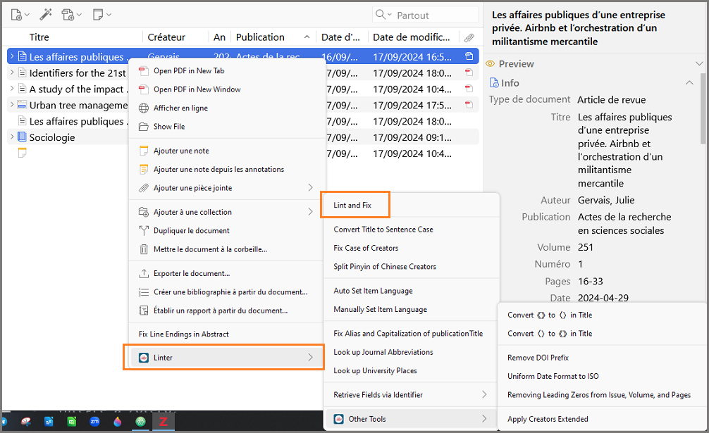

📌 Ces corrections peuvent être configurées et/ou désactivées de la commande _Lint and Fix_ dans les paramètres de _Linter_.

Parmi les multiples fonctionnalités de _Linter_, nous retenons celles que nous avons pu tester avec succès et qui nous semblent de l'usage le plus courant.

#### Corriger la casse des titres, des titres de revues et des auteurs

Zotero 7 intègre désormais certaines de ces corrections, mais _Linter_ apporte diverses améliorations.

* Pour les **auteurs**, la fonctionnalité manuelle de Zotero peut être rendue automatique.
* Pour les **titres**, _Linter_ ajoute à la fonctionnalité de Zotero de conversion automatique de la casse de titre vers la casse de phrase la prise en compte de certains noms propres (notamment les formules chimiques).
* Pour les **titres de revues**, il s'agit d'appliquer la casse de titre.

⚠️ Il n'est pas d'usage d'utiliser la casse de titre pour les titres de revues françaises, aussi il est plus prudent d'exclure cette option de la commande _Lint and Fix_ si vous citez beaucoup d'articles de revues françaises.   

#### Corriger les abréviations de revue

_Linter_ peut compléter et/ou corriger le champ "Abrév. de revue" automatiquement, en fonction de l'une des options suivantes.

* L'abréviation doit être présente et conforme à [la norme ISO4](https://fr.wikipedia.org/wiki/ISO_4).
* L'abréviation doit correspondre à celle présente **dans une liste personnalisée** que vous devez alors charger dans l'application (fonctionnalité non testée par nos soins).
* L'abréviation est déduite du titre de la revue selon les règles d'abréviation standardisées internationales.

#### Normaliser les données de certains champs

* Appliquer pour les **dates** le format ISO YYYY-MM-DD.
* Supprimer le préfixe d'URL du champ **DOI**.
* Supprimer les 0 au début des numéros de volume, numéro et pages.

#### Raccourcis clavier pour l'italique, le gras, etc.

Si Zotero permet d'appliquer une mise en forme enrichie à une partie d'un champ, il demeure fastidieux de saisir manuellement les balises html correspondantes.

![zotero][zotero] [Documentation Zotero : Comment puis-je mettre en forme certains mots d'un titre: par ex. en italique, en exposant ou en indice ?](https://docs.zotero-fr.org/kb/rich_text_bibliography/)

Avec _Linter_, les raccourcis clavier courants (ceux de Microsoft Word par exemple) peuvent être utilisés. Une fois le texte sélectionné, les combinaisons suivantes produisent la mise en forme indiquée.

- Exposant : `Ctrl` + `Shift` + `+`
- Indice : `Ctrl` + `=`
- Gras : `Ctrl` + `B`
- Italique : `Ctrl` + `I`
- Pas de casse: `Ctrl` + `N` - Le paramètre `class="nocase"` empêche certains noms spéciaux de se voir attribués une initiale en majuscule comme le prévoit par défaut la casse de phrase de CSL.

⚠️ Cette fonctionnalité n'est pas intégrée aux commandes _Lint_. Elle ne fait pas l'objet de réglages dans les paramètres de _Linter_.

### 2.5 Apports de l'extension Actions & Tags pour mettre à niveau les informations bibliographiques et organiser son flux de travail

#### Aperçu

_Actions & Tags_ permet tout d'abord d'optimiser votre organisation et votre flux de travail, en définissant des actions déclenchées automatiquement et/ou manuellement. Ces actions peuvent effectuer différentes opérations, notamment l'ajout et le retrait de marqueurs.

Les **scripts personnalisés** offrent des options avancées, tant pour l'organisation de la bibliothèque que pour la mise à niveau ou la modification des informations bibliographiques.

#### Exemple : les actions "à lire"

_Actions & Tags_ travaille déjà pour vous dès son installation.

Ainsi, le marqueur `/unread` est désormais automatiquement ajouté et retiré aux nouveaux documents de votre bibliothèque grâce à 2 actions paramétrées dans _Actions & Tags_.

Enregistrez un document **avec un fichier PDF joint** dans votre bibliothèque, avec le connecteur Zotero, la baguette magique ou encore un import de fichier. Le marqueur `/unread` lui est automatiquement ajouté.

Ouvrez **le fichier PDF joint** à ce document, lisez-le et refermez-le. Le marqueur `/unread` est automatiquement retiré du document.

#### Créer des actions

_Actions & Tags_ s'adresse tant aux utilisateurs novices qu'aux utilisateurs experts, dotés de connaissances en codage informatique. Il permet en effet à la fois :

* de créer simplement et facilement des actions en combinant des options de menu déroulant et en saisissant quelques valeurs,
* de créer des scripts personnalisés en codant toutes les instructions.

#### Paramètres des actions

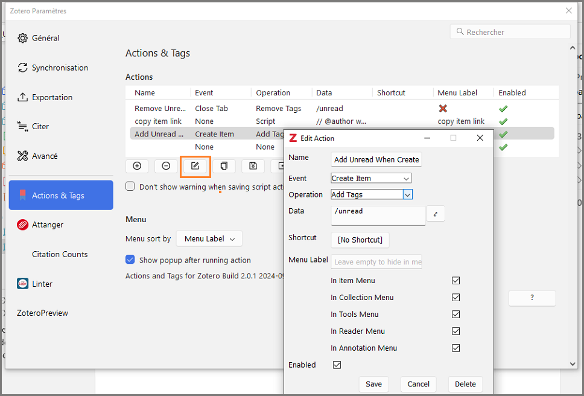

##### Libellés : _Name_ et _Menu Label_

Le libellé défini dans le champ _Name_ est utilisé uniquement dans la fenêtre de paramétrage.

Le libellé saisi dans _Menu Label_ s'affiche dans les menus contextuels dans lesquels vous choisissez de faire apparaître l'action. Dans le menu des annotations, l'option s'affiche directement. Dans les autres menus, elle apparaît derrière le menu ou le bouton _Trigger Action_. Si aucune valeur n'est saisie, l'action est masquée.

##### Événement qui déclenche l'action : _Event_

Le tableau ci-dessous présente les différents événements qui peuvent être définis pour déclencher automatiquement l'opération à effectuer. Il s'agit d'événements simples et univoques tels que la création d'un document, d'une annotation et d'une note, ou encore du démarrage de Zotero.

Avec la valeur _None_, l'action est ne peut pas être déclenchée automatiquement. Elle doit être lancée manuellement.

<details style="text-indent: 4em">
<summary>Afficher les événements pris en charge</summary>

| Evénement              | Description : l'action est déclenchée  quand...        |
| ------------------ | --------------------------------------------------------- |
| `Create Item`       | Un document est créé.             |
| `Open File`         | Le fichier joint est ouvert.        |
| `Close Tab`         | L'onglet du lecteur de PDF est fermé.     |
| `Create Annotation` | Une annotation est créée.                  |
| `Create Note`       | Une note est créée.                         |
| `Append Annotation` | Une annotation est ajoutée au document cible.  |
| `Append Note`       | Une note est ajoutée au document cible.         |
| `Program Startup`   | Le client Zotero ou Actions & Tags démarre. |
| `Main Window Load`   | La fenêtre principale est chargée.                 |
| `Main Window Unload` | La fenêtre principale est refermée.      |

</details>

##### Opération effectuée par l'action : _Operation_

Les opérations prédéfinies concernent principalement les marqueurs.

<details style="text-indent: 4em">
<summary>Afficher les opérations prises en charge</summary>

| Opération      | Description                                                                    |
| -------------- | ------------------------------------------------------------------------------ |
| `Add Tags`      | Ajoute le marqueur(s) au document cible.                                        |
| `Remove Tags`   | Retire le marqueur(s) du document cible.                                      |
| `Toggle Tags`   | Bascule le marqueur(s) : le marqueur est ajouté si le document ne l'a pas et retiré dans le cas contraire.                                                                                  |
| `Script` | Exécute un script personnalisé.                                                |
| `Trigger Other Actions`  | Lance d'autres actions personnalisées.                                    |

</details>

##### Données de l'action : _Data_

Pour les opérations concernant les **marqueurs**, il s'agit des marqueurs séparés par des virgules.

Pour les **scripts personnalisés**, il s'agit du code du script.

Pour le **lancement d'autres actions**, il s'agit du nom des actions (une par ligne).

#### Créer une action simple

Nous allons maintenant créer une action personnalisée simple, c'est-à-dire en utilisant essentiellement les menus déroulants pour effectuer la configuration.

🕰️ Voici les indications pour créer cette action, vous disposez de **5 minutes** pour cela.

📝 On souhaite ajouter automatiquement au document un marqueur `_lu et annoté` quand une note fille lui est ajoutée.

#### Utiliser un script personnalisé

Il existe déjà des scripts personnalisés, créés par des utilisateurs ou par le développeur de _Actions & Tags_. Ce dernier relit et valide tous les scripts, toutefois il recommande la prudence à l'égard de ces programmes, qui peuvent être puissants.

🕰️ Nous prenons **15 minutes** pour les 2 activités suivantes.

📝 Nous installons ensemble le script personnalisé [Bulk Edit Multiple Items](https://github.com/windingwind/zotero-actions-tags/discussions/343) ; vous choisissez les libellés et/ou le raccourci-clavier qui vous conviennent le mieux. 

📝 Voici 2 exemples de scripts personnalisés. Vous sembleraient-ils utiles pour votre revue littérature? En repérez-vous d'autres dans [la liste complète des scripts personnalisés référencés](https://github.com/windingwind/zotero-actions-tags/discussions/categories/action-scripts)?

* [Collection Tags](https://github.com/windingwind/zotero-actions-tags/discussions/245)
* [Batch Tag Operations](https://github.com/windingwind/zotero-actions-tags/discussions/351)

### 2.6 Organiser la bibliothèque avec les marqueurs et les recherches enregistrées
Zotero dispose de plusieurs outils pour organiser une bibliothèque :

* les **collections** -> plus ou moins des dossiers, plutôt des listes de lecture,
* les **marqueurs** -> des mots-clés,
* les **recherches enregistrées** -> des collections dynamiques,
* les **liens connexes** -> pour lier entre eux des documents selon les critères qui font sens pour vous,
* les **notes** -> indexées par le moteur de recherche de Zotero, saisies dans un éditeur html permettant une mise en forme et/ou créées à partir des annotations de PDF.

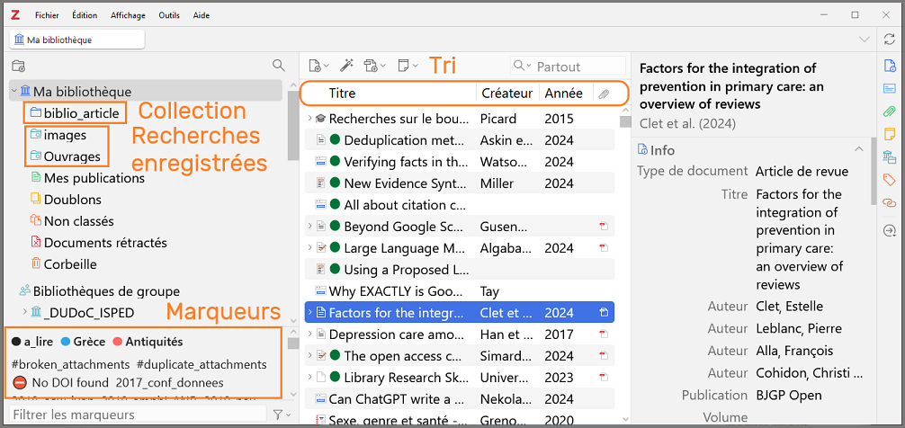

Pourquoi privilégier les marqueurs plutôt que les collections?

On peut avancer 2 raisons principales.

* **Lisibilité** : grâce aux **marqueurs colorés** vous visualisez rapidement tous les documents associés à un marqueur. Vous pouvez de plus facilement **filtrer** vos marqueurs dans le sélecteur de marqueurs. Cela autorise à en créer beaucoup sans risque de confusion : vous pouvez envisager de recourir à un système de marqueurs pour suivre vos décisions d'exclusion, en indiquant également le stade et le motif, par exemple **_EXCLU_TitAbs_C1** pour un article exclu au stade du tri sur titre/résumé, sur le premier critère d'exclusion.
* **Portabilité** : les marqueurs font partie des informations bibliographiques du document et sont ainsi, par exemple, exportés au même titre que toutes les autres informations bibliographiques lorsque vous exportez des documents dans un fichier au format .ris, . csv, etc. Les collections et les recherches enregistrées relèvent en revanche de **l'interface** de votre bibliothèque, l'information du classement dans une collection n'est pas enregistrée en tant qu'information bibliographique du document.

#### Conserver ou non les marqueurs enregistrés automatiquement?

Par défaut, Zotero enregistre automatiquement les mots-clés associés au document dans la base à partir de laquelle vous l'avez enregistré : indexation Rameau dans le Sudoc, mots-clés auteur dans les sites d'éditeur et les bases de données bibliographiques, indexation contrôlée dans les bases de données bibliographiques. Tous ces termes hétérogènes accumulés peuvent finir par produire une liste de termes redondants (synonymes, variantes diverses d'un même mot) difficile à exploiter, et qui vient parasiter votre liste de marqueurs personnels.

Vous pouvez désactiver cet enregistrement depuis les _Paramètres_ > _Général_ > _Divers_ > _Ajouter automatiquement aux documents des marqueurs à partir des mots-clés fournis_.

Notez toutefois que même en décochant cette case vous enregistrerez toujours les mots-clés associés lorsque vous ajoutez des documents via un **import de fichier** et non via le navigateur. Décocher cette case ne désactive pas l'import du champ _keywords_ (ou équivalent) présent dans un fichier bibliographique. Il y a donc de fortes chances que vous retrouviez tout de même des marqueurs ajoutés automatiquement dans votre bibliothèque. Par ailleurs, il est parfois utile de se référer aux mots-clés auteurs ou aux indexations contrôlées d'une base de données.

Pour conserver une liste de marqueurs personnels propre, facile à exploiter et bien distincte des marqueurs ajoutés automatiquement, la meilleure option est par conséquent de **préfixer** ses marqueurs personnels au moyen d'un signe typographique tel que le tiret bas `_`. Vos marqueurs personnels seront ainsi non seulement facilement identifiables, mais toujours présentés en premier dans le sélecteur de marqueurs.

#### Les recherches sauvegardées pour automatiser l'organisation

💡 **Laissez Zotero travailler pour vous**

N'oubliez pas que le classement dans les collections, l'ajout de marqueurs, etc. nécessitent une saisie manuelle et prennent du temps. **Les recherches sauvegardées** sont un excellent moyen de gagner du temps et de l'efficacité, en utilisant automatiquement les informations que vous avez récupérées et celles que vous avez ajoutées pour chaque document.

Les recherches sauvegardées prennent en charge une syntaxe relativement riche.
Pour retrouver toutes les références pour lesquelles un champ est vide, par exemple les références sans résumé, il suffit de créer une recherche sur le modèle suivant :

```
Résumé -- Ne contient pas -- %
```

### 2.7 Optimiser la recherche du texte intégral

Zotero dispose de fonctionnalités par défaut pour rechercher et enregistrer automatiquement le texte intégral, telles que les suivantes.

* **L'enregistrement automatique du PDF présent sur une page web** lorsque vous utilisez le connecteur Zotero (bouton Zotero dans votre navigateur).
* La détection et l'enregistrement automatiques du **proxy de l'université** pour vous rediriger vers les accès souscrits par l'université lorsque vous naviguez sur les sites des éditeurs - voir [Documentation Zotero : Les préférences du connecteur Zotero > Préférences pour les serveurs mandataires](https://www.zotero.org/support/fr/connector_preferences?do=#preferences_pour_les_serveurs_mandataires).
* La recherche automatique de **PDF disponibles en libre accès** grâce à Unpaywall - [description de la fonctionnalité sur le blog Zotero francophone](https://zotero.hypotheses.org/2130).

Deux fonctionnalités complémentaires vous permettent d'augmenter ces fonctions de recherche. Elles sont toutes les 2 accessibles depuis **le menu _Localiser_**, c'est-à-dire la flèche entourée d'un cercle en bas de la barre de raccourcis du panneau de droite. Il s'agit de :

* la **configuration OpenURL** de votre établissement de rattachement,
* la personnalisation des **moteurs de recherche intégrés à Zotero**.

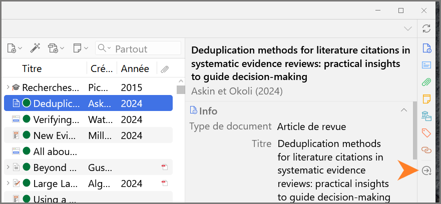

![zotero][zotero] [Documentation Zotero : Le menu Localiser](https://docs.zotero-fr.org/locate)

#### Configuration OpenURL

Dans la section _Paramètres_ > _Général_, rubrique _Localiser_, ouvrez le menu déroulant _Résolveur de liens_ et naviguez dans la liste géographique pour sélectionner votre établissement.

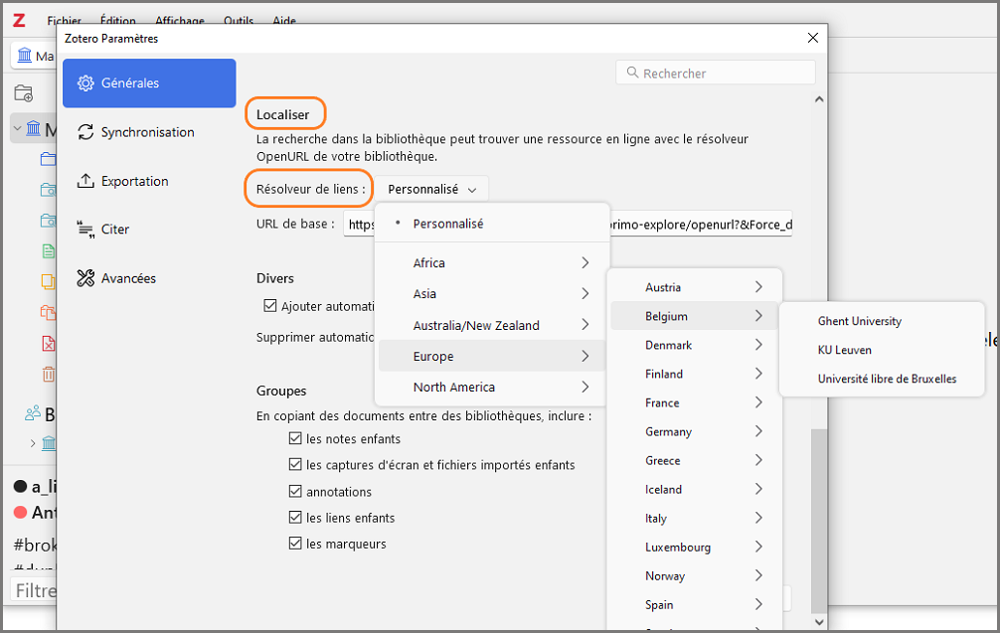

Pour lancer la recherche OpenURL dans les ressources de votre établissement, il vous suffira de cliquer sur l'option _Recherche dans la bibliothèque_ du menu _Localiser_.

#### Moteurs de recherche intégrés à Zotero
Ces moteurs de recherche vous permettent de lancer une recherche dans diverses sources pour trouver un fichier de texte intégral disponible sur un site web personnel (moteurs Google, Google Scholar), ou pour compléter les informations bibliographiques de vos documents (moteur Sudoc pour les livres et les thèses, moteur PubMed pour les articles, moteurs Isidore, etc.).

Pour en savoir plus concernant la personnalisation des moteurs de recherche, consultez le billet du blog Zotero francophone [Les moteurs de recherche intégrés à Zotero](https://zotero.hypotheses.org/3388).

##### Installer un fichier de moteurs de recherche préconfigurés

📝 Plusieurs fichiers de moteurs de recherche préconfigurés sont disponibles en annexe au billet du blog Zotero francophone précédemment cité, ils sont disponibles sur [le dépôt GitHub du blog](https://github.com/zfrancophone/zfrancophone-blog/tree/master/2020-05-moteurs) .

Choisissez celui qui vous semble le plus adapté à vos besoins et installez-le dans Zotero, en suivant les indications fournies

ℹ️ Rappel : pour accéder à votre répertoire de données Zotero depuis les _Paramètres_ de Zotero, cliquez sur : _Avancé_ > _Fichiers et dossiers_ > _Ouvrir le répertoire de données_.

## 3. Les outils de Zotero au service du travail d’analyse d’une revue de littérature

### 3.1 Enregistrer les liens de citation dans Zotero 

La recherche de citations, ou _snowballing_, fait partie des méthodes de recherche bibliographique utilisables pour une revue de littérature ; elle peut être requise. Cette recherche peut s'entendre dans les deux sens de citation, en amont et en aval, et porter par conséquent sur les références citées et/ou citantes.

L'export des références citées et citantes est intégrée dans les deux principaux index de citation commerciaux, **Scopus** et **Web of Science**. D'autres services, gratuits, exploitent cette méthode de recherche et peuvent permettre de mener ce type de recherche, voir la fiche [Constituer et explorer des corpus d’articles avec Connected Papers, Research Rabbit et Citation Chaser](https://github.com/fflamerie/intro_revlit/blob/main/docs/Fiche_ExploLit.pdf)
 ; nous nous en tenons ici à l'exemple de Citation Chaser.

#### Retrouver les références citées et citantes avec Citation Chaser
[Citation Chaser](https://estech.shinyapps.io/citationchaser/), développé et mis à disposition par des chercheurs en écologie, présente de nombreux avantages.

* Son utilisation est **libre et gratuite**.
* La base de données d'indexation des citations utilisée est la base de données non commerciale de **The Lens**, offrant une couverture plus large que celle de Scopus ou du Web of Science puisqu'elle combine les données notamment de Microsoft Academic, PubMed, CORE et Crossref.
* La recherche et l'export des références citées et citantes est très simple et rapide à effectuer, comme le montre les captures d'écran ci-dessous. Ces captures présentent le cas de la recherche à partir d'un seul article, toutefois il est possible de saisir en entrée **plusieurs articles**.

1.  L'onglet _Article input_ permet de charger les articles à considérer, à partir de la saisie d'un de leurs identifiants (PMID, DOI, etc. ), d'un fichier .csv ou d'un fichier .ris.

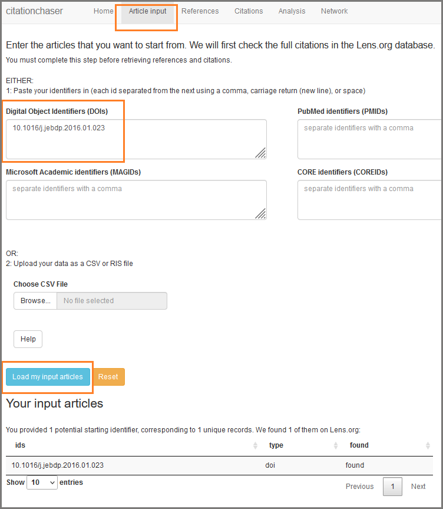

2.  Les onglets _References_ et _Citations_ permettent ensuite de rechercher et exporter au format .ris respectivement les références citées et les références citantes.

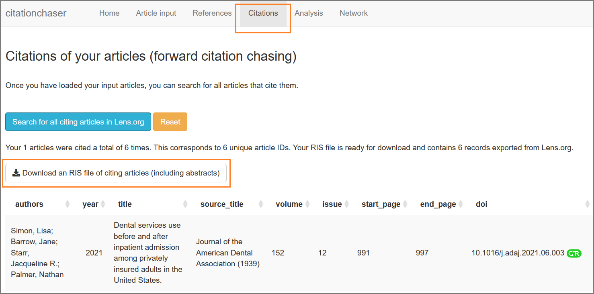

3. Les onglets _Analysis_ et _Network_ fournissent des fonctionnalités complémentaires d'analyse et de visualisation.

Haddaway, N. R., Grainger, M. J., Gray, C. T. 2021. citationchaser: An R package and Shiny app for forward and backward citations chasing in academic searching. doi: [10.5281/zenodo.4543513](https://doi.org/10.5281/zenodo.4543513)

#### Restituer les liens de citation dans Zotero

Une fois les références citées et/ou citantes retrouvées, comment restituer ces liens de citation dans Zotero? Au moins deux approches, toutefois limitées à différents égards, sont possibles.

La première consiste à utiliser la fonction **Connexe** pour associer les documents liés par des liens de citation. Les liens créés étant réciproques et non qualifiés, il peut toutefois être difficile de retrouver _a posteriori_ la signification de ces liens.

Une seconde approche consiste à utiliser les marqueurs, en créant par exemple un marqueur `_cite_10.000Z`, associé à toutes les références citant l'article identifié par le DOI 10.000Z.

### 3.2 Annoter ses PDF avec Zotero

#### Le lecteur de PDF

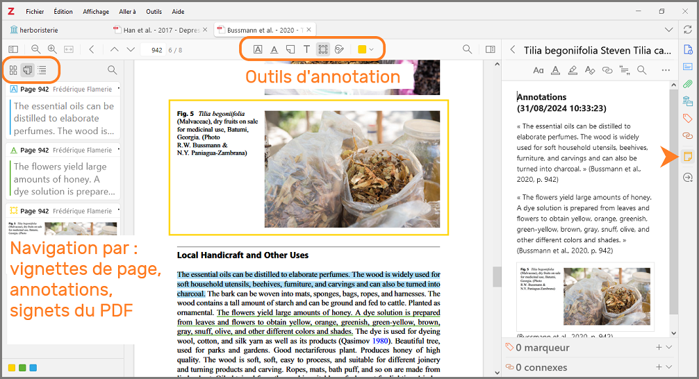

Le **lecteur de PDF** intégré à partir de Zotero 6 prend en charge depuis Zotero 7 les fichiers **EPUB** et les **captures de pages web**. Il offre notamment les fonctionnalités suivantes. Notez que ces fonctionnalités se combinent à celles d'un puissant **éditeur de notes**.

* Ouvrir les fichiers soit dans la fenêtre principale de Zotero dans une interface à onglets, soit dans des fenêtres distinctes.
* Modifier les informations bibliographiques d’un document tout en visualisant le fichier associé.
* **Annoter** les fichiers avec des outils variés, parmi lesquels :
  * créer des annotations textuelles ou manuscrites (uniquement dans les fichiers PDF),
  * surligner et souligner avec 8 couleurs différentes,
  * extraire du texte et des images et les commenter.
* Intégrer systématiquement les **informations de citation**, y compris la page, à chaque annotation.
* **Ajouter les annotations dans des notes Zotero** : créer automatiquement une note à partir de toutes les annotations d'un fichier, ou ajouter des annotations provenant de différents fichiers à une même note.
* **Citer depuis les annotations** :  le nouveau bouton "Add Note" dans l'extension de traitement de texte insère le contenu d'une note Zotero et les citations associées.

#### Gestion des annotations

Les annotations créées dans le lecteur de fichiers de Zotero ne sont pas lisibles directement dans un lecteur de PDF externe. Elles ne sont en effet pas stockées dans le fichier mais **dans votre base de données Zotero**.

Zotero peut **importer les annotations** effectuées dans un lecteur de PDF externe. Pour **exporter** de Zotero des PDF avec leurs annotations intégrées, procédez comme suit.

* Sélectionnez les documents parents des PDF dans votre bibliothèque Zotero.
* Dans la barre de menu de Zotero, choisissez l'option _Fichier_ > _Exporter le PDF..._

Les annotations peuvent être organisées au travers de la bibliothèque grâce aux **marqueurs**. Les couleurs d'annotation permettent uniquement de filtrer les annotations d'un même fichier PDF.

Enfin, dans les **bibliothèques de groupe** les annotations de chaque contributeur sont identifiées et verrouillées : chacun ne peut modifier que ses propres annotations.

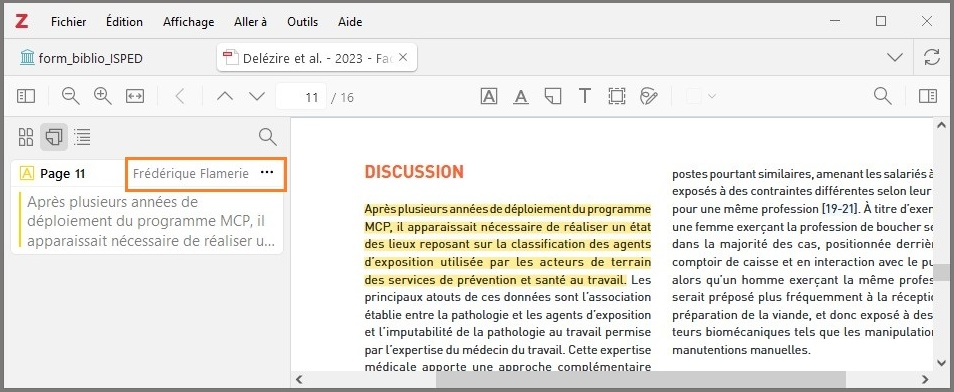

#### Ressources sur le lecteur de PDF

![zotero][zotero] [Documentation Zotero : Le lecteur PDF et l'éditeur de notes de Zotero](https://docs.zotero-fr.org/pdf_reader)

![zotero][zotero] [Base de connaissance Zotero : Pourquoi Zotero stocke-t-il les annotations PDF dans sa base de données plutôt que dans le fichier PDF ?](https://docs.zotero-fr.org/kb/annotations_in_database)

📺 Vidéo de "La Boîte à outils des  historien·ne·s" :

Heimburger, F. (2022, avril 21). Découvrir Zotero 6 - Le lecteur de pdf et la prise de notes en vidéo. La boîte à outils des historien·ne·s. https://boiteaoutils.info/2022/04/decouvrir-zotero-6-le-lecteur-de-pdf-et-la-prise-de-notes-en-video/

### 3.3 Services complémentaires 
Parmi les services complémentaires que peut vous offrir Zotero, on retient notamment les suivants, à l'appui d'une part du **suivi des citations reçues** et d'autre part du **repérage des articles frauduleux**.

#### Extensions Scite et Citation Counts Manager

Ces deux extensions permettent de suivre les citations reçues par un article et sont davantage complémentaires que concurrentes.

[Zotero 7 Citation Counts Manager Enhanced](https://github.com/FrLars21/ZoteroCitationCountsManager) offre le choix de la base de données source pour le comptage des citations [Crossref](https://www.crossref.org), [INSPIRE-HEP](https://inspirehep.net) ou [Semantic Scholar](https://www.semanticscholar.org) et affiche un nombre unique de citations, ce qui permet de trier rapidement les documents de la bibliothèque par ordre croissant ou décroissant de citations reçues.


[L'extension Scite](https://github.com/scitedotai/scite-zotero-plugin) reporte quant à elle les nuances de qualification effectuées par scite.ai, soit un classement des citations selon les 3 catégories suivantes :

* les citations **appuyant** les conclusions de la publication (_Supporting_),
* les citations **contredisant** les conclusions la publication (_Contrasting_),
* les citations **neutres** qui mentionnent simplement la publication (_Mentioning_).

Un lien vers le rapport complet sur Scite.ai est également ajouté dans le volet de droite, dans la barre des raccourcis.

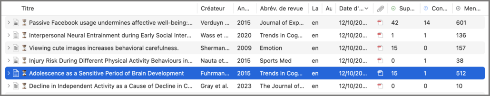

#### Extension PubPeer et intégration Retraction Watch

[L'interaction avec Retraction Watch](https://zotero.hypotheses.org/2809) est intégrée dans Zotero et elle fonctionne sans qu'aucune installation complémentaire ne soit nécessaire. Elle vous signale les articles rétractés non seulement dans votre bibliothèque Zotero, mais également dans votre traitement de texte, par un avertissement de l'extension de traitement de texte Zotero si l'article que vous vous apprêtez à citer a été rétracté.

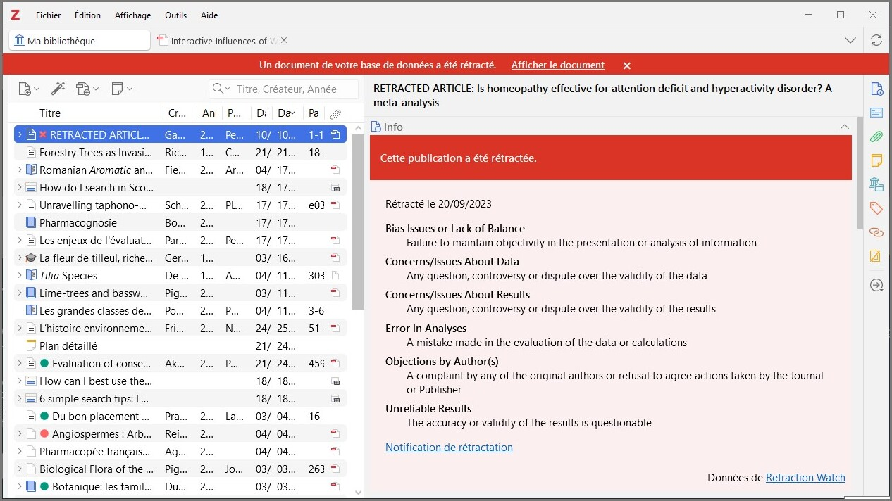

En complément de cette interaction, [l'extension PubPeer](https://github.com/PubPeerFoundation/pubpeer_zotero_plugin) affiche dans le volet central de Zotero le nombre de commentaires PubPeer reçus, et davantage de détails dans une rubrique dédiée du volet de droite.

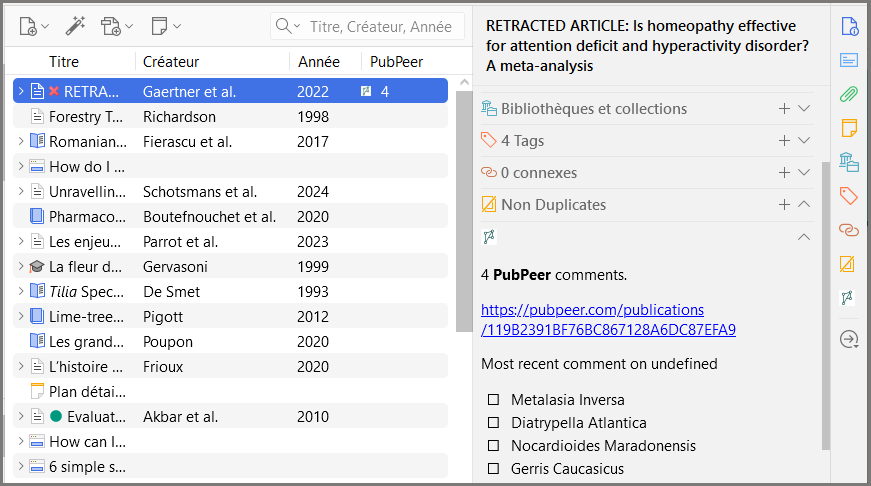

## 4. Rendre compte des résultats d’une revue de littérature
### 4.1 Rappels sur les styles bibliographiques et la rédaction bibliographique

🎯 Quiz : les styles bibliographiques

#### Les types de style bibliographique

Un style bibliographique définit la façon dont les éléments bibliographiques d’un texte sont organisés et mis en forme. C’est ainsi le style qui prescrit quelles informations bibliographiques sont affichées, dans quel ordre et selon quelle mise en forme (gras, italique, guillemets, ponctuation, retraits et espacements, etc.).

On considère 2 éléments.

* Les **citations** : elles peuvent être insérées soit sous la forme d’**appels de citation dans le texte** (numéro, nom de l’auteur et date, etc.), soit sous la forme de références plus ou moins abrégées en **notes** de bas de page ou de fin.
* La **bibliographie** ou **liste des références citées**.

On distingue différents types de style bibliographiques, correspondant à des formats de style Zotero différents. On trouve ainsi dans [le dépôt des styles Zotero](https://www.zotero.org/styles), plus de 10'000 styles regroupés en 2 grands ensembles :

* les styles _**in-text**_, dans lesquels un appel de citation dans le texte renvoie à une entrée de la bibliographie,
* les styles _**note**_, dans lesquels un marqueur (symbole, nombre, etc.) pointe vers une note de bas de page ou de fin.

#### Comment choisir un style bibliographique quand aucun n'est imposé?

Les critères de choix suivants peuvent être pris en compte.

##### Critère de choix 1, existence d'un modèle de référence
Existe-t-il un style de référence ou fréquemment utilisé dans votre domaine? Par exemple "Vancouver" et "American Psychological Association" pour les sciences de la santé, "Modern Language Association" pour certains domaines de la littérature, "IEEE" pour les sciences de l'ingénieur, etc.

##### Critère de choix 2, typologie documentaire prise en charge
Citez-vous de nombreux types de documents différents? Tous les styles ne prennent pas en charge tous les types de documents. Le style _Nature_, par exemple, ne sera pas le plus adapté si vous citez des documents non publiés comme les thèses. La revue _Nature_ demande aux auteurs de citer un nombre restreint de types de document (voir les [instructions aux auteurs](http://www.nature.com/nature/for-authors/formatting-guide), rubrique _References_), aussi le style CSL pour Zotero _Nature_ encode-t-il la mise en forme des citations uniquement pour ces types de document.

##### Critère de choix 3, langue de rédaction
Rédigez-vous seulement en français ? Seulement dans une autre langue ? Dans différentes langues selon les cas ? Si certains styles sont agnostiques du point de vue de la langue, d'autres ont au contraire une langue prédéfinie qui ne peut pas être modifiée. Ainsi le style _Nature_ est-il paramétré uniquement pour la langue anglaise, selon la norme britannique.

Tous les styles localisés pour une langue autre que l’anglais comporte le nom de cette langue dans leur intitulé. Ainsi, rechercher « français » dans le dépôt des styles Zotero affiche uniquement les styles localisés pour la langue française, « deutsch » uniquement les styles localisés pour la langue allemande, etc. Les styles sans mention de langue sont soit localisés en anglais, soit agnostiques du point de vue de la langue.

Limiter l’utilisation d’un style à une langue déterminée permet d’éviter les erreurs de la part des utilisateurs : quelle que soit la langue par défaut de l’utilisateur, ce dernier ne pourra pas rédiger les éléments bibliographiques dans une autre langue que celle prévue par le style bibliographique. Une revue publiant des articles dans une unique langue se prémunira ainsi des erreurs de langue en localisant son style bibliographique. Par ailleurs, cela permet de définir précisément et rigoureusement la ponctuation et de s’assurer du respect scrupuleux des règles de typographie, prescrivant par exemple d’insérer une espace insécable avant le point-virgule en français.

#### Comparer facilement des styles dans Zotero

Deux outils facilitent la comparaison des styles bibliographiques dans Zotero :

* la fonctionnalité _Aperçu des styles_ intégrée dans Zotero et accessible depuis les depuis les _Paramètres_ > _Citer_,
* l'extension [ZoteroPreview](https://github.com/dcartertod/zotero-plugins).

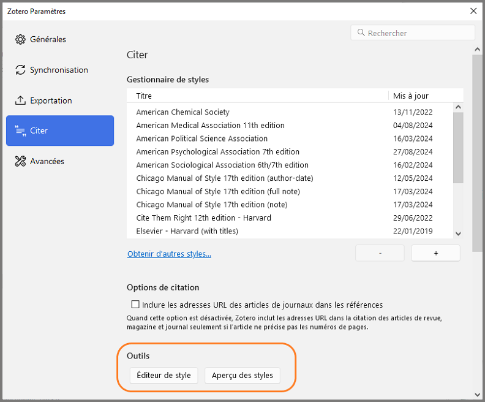

On ne considère pas ici l'entrée bibliographique qui peut être affichée en en-tête du panneau de droite. Cette fonctionnalité n'affiche pas la **citation**, or il s'agit d'un aspect important à prendre en compte dans la comparaison des styles de type **auteur-date** et **note**.

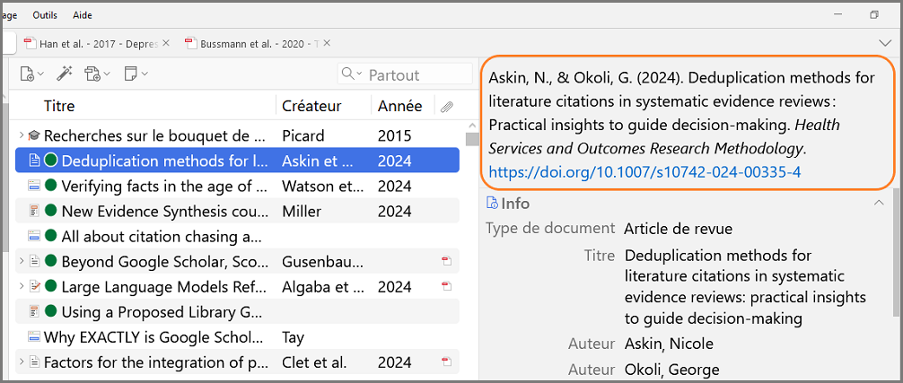

##### L'aperçu des styles

L’aperçu des styles présente le double avantage d’être intégré à Zotero et de générer un aperçu à partir d’une ou plusieurs références sélectionnées dans la bibliothèque Zotero. En revanche plusieurs clics sont nécessaires pour générer l’aperçu, dont la lecture peut être difficile si vous avez installé un grand nombre de styles.

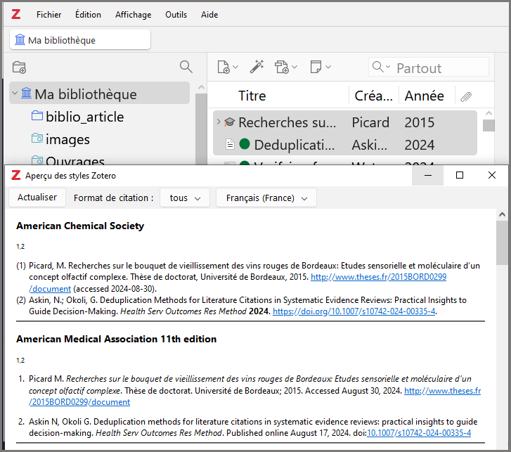

##### ZoteroPreview

[ZoteroPreview](https://github.com/dcartertod/zotero-plugins) offre un affichage immédiat de la mise en forme effectuée par un style bibliographique, en revanche il n’est pas possible de sélectionner plusieurs références ni plusieurs styles en même temps. ZoteroPreview est une extension et il n’est donc pas installé par défaut dans Zotero.

ZoteroPreview affiche un aperçu de la citation et/ou de l'entrée bibliographique du document dans le panneau de droite, avec un bouton de copie.

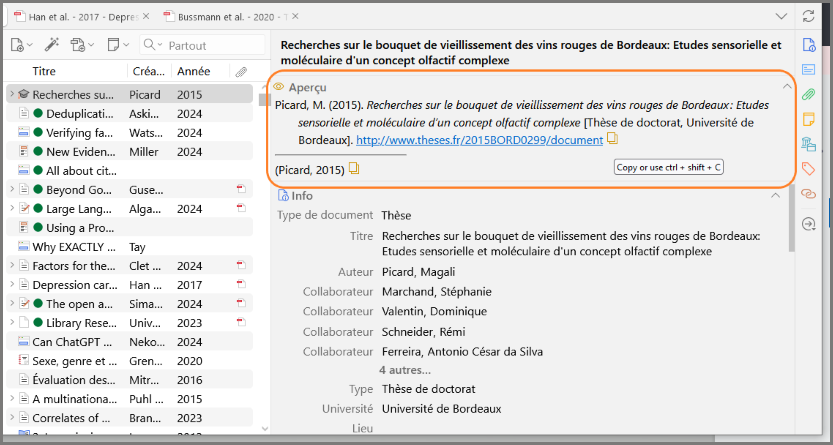

La section _ZoteroPreview_ des  _Paramètres_ de Zotero, ajoutée lors de l'installation de l'extension, permet de définir :

* le style bibliographique à appliquer,
* la position de l'aperçu dans le panneau de droite (en haut, en bas ou après la section Info),
* la taille des caractères et l'espacement des interlignes.

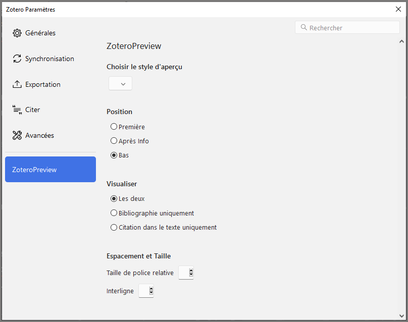

##### Points de vigilance

Quel que soit l'outil et la méthode utilisés pour comparer des styles, il importe de s'assurer de deux points afin que la comparaison soit significative et utile.

Tout d'abord, assurez-vous que les documents que vous utilisez comme exemples reflètent la **diversité de types de documents** que vous allez citer (article, chapitre, mais aussi thèse ou encore brevet ou film) : vous vérifierez ainsi que tous ces types sont bien pris en charge par les styles que vous comparez.

Ensuite, et surtout, assurez-vous que ces documents sont complets et exacts dans votre bibliothèque Zotero.

* **S'il manque des informations bibliographiques**, il est logique que le style ne puisse pas les afficher quand il génère les citations et la bibliographie.
* **Si vous faites un usage inadéquat ou détourné de certains champs**, vous générerez également une bibliographie détournée ou inadéquate, ne correspondant pas au résultat que produit le style normalement.

#### Comparatif de styles bibliographiques en SHS

Les bibliothèques universitaires de Nanterre proposent un tableau comparatif synthétique des styles suivants :

* APA 7ème édition (auteur-date),
* Petit Chicago (auteur-date),
* Tapuscrit (auteur-date),
* Presses universitaires de Rennes (note),
* Tapuscrit (note),
* Triangle (note),
* Université de Liège - Droit (note),
* Université de Bordeaux - Ecole doctorale de droit (note).

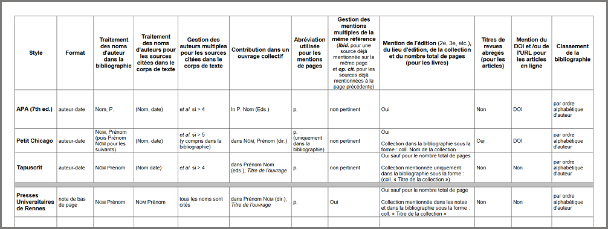

Voir : Willemin, E. (2022, avril 5). Quel style Zotero choisir pour son mémoire / sa thèse ? Université Paris Nanterre - Bibliothèques universitaires. http://bu.parisnanterre.fr/sautoformer/quel-style-zotero-choisir-pour-son-memoire-sa-these

#### Modifier un style

Parmi tous les styles disponibles aucun ne convient précisément au rendu que vous souhaitez ou devez obtenir?

Modifier un style bibliographique Zotero, écrit dans le langage informatique CSL, est plus ou moins trivial. Il est ainsi très simple de **classer les références par type de document dans la bibliographie**, vous trouverez comment procéder dans [la section "Créer une bibliographie par type de document" de cet atelier CSL](https://github.com/fflamerie/zotero_csl_libreABC/blob/main/docs/CSL_cours.md#cr%C3%A9er-une-bibliographie-par-type-de-document). Il est en revanche généralement beaucoup plus complexe de modifier l'ordre des informations bibliographiques ou d'en ajouter de nouvelles.

Deux billets du blog Zotero francophone pourront vous aider si vous souhaitez vous lancer dans l'aventure CSL.

- [Apporter de petites modifications à un style bibliographique](https://zotero.hypotheses.org/3746)
- [Bonnes pratiques pour la création d'un style CSL](https://zotero.hypotheses.org/5302)

#### Citer avec Zotero : les extensions de traitement de texte et les autres outils

Zotero dispose de différents outils pour générer des listes bibliographiques, qu'il s'agisse de produire [un rapport](https://docs.zotero-fr.org/reports), une [bibliographie indépendante](https://docs.zotero-fr.org/creating_bibliographies/#menu-contextuel-pour-creer-une-citationbibliographie), la liste des références citées ou encore d'[insérer quelques références](https://docs.zotero-fr.org/creating_bibliographies/#copie-rapide) dans un courriel ou un diaporama .

[Les extensions de traitement de texte](https://docs.zotero-fr.org/word_processor_integration/#les-extensions-pour-logiciel-de-traitement-de-texte) sont l'outil le plus adapté pour produire la liste récapitulative des références citées dans un texte. Elles disposent de plus de fonctionnalités spécifiques, telles que **l'abréviation automatique des titres de revue**. Ainsi si vous devez rédiger une bibliographie indépendante dans laquelle les titres de revue sont abrégés, le plus efficace pourrait bien être d'effectuer un détour par l'extension de traitement de texte en :
* insérant en citations Zotero toutes les références à inclure dans la bibliographie,
* puis en insérant la bibliographie,
* et enfin en supprimant les codes de champ.

Un dernier point mérite d'être souligné s'agissant des extensions de traitement de texte, à savoir [les limitations de l'intégration Google Scholar](https://docs.zotero-fr.org/google_docs/#limitations), qui imposent une vigilance particulière si vous choisissez ce service pour la rédaction collaborative. Si la rédaction collaborative n'est pas une nécessité, alors il est préférable de recourir à un traitement de texte local pris en charge par Zotero.

#### Reference Extractor pour visualiser dans sa bibliothèque Zotero les documents cités dans un fichier de traitement de texte

La fonctionnalité première du service en ligne [Reference Extractor](http://rintze.zelle.me/ref-extractor/) est, comme son nom l’indique, d’extraire des références bibliographiques d’un document rédigé, à partir d'un fichier de traitement de texte. Cette extraction peut être réalisée si les conditions suivantes sont réunies.

* Le fichier de traitement de texte est un fichier Word au format **.docx** ou un fichier LibreOffice au format **.odt**.
* Les citations ont été insérées avec **Zotero** ou **Mendeley**. Pour un fichier LibreOffice, il faut que les citations soient stockées sous la forme de **Signets** et non de **Marques de référence** (option par défaut).
* Les citations sont toujours actives et n’ont pas été converties en texte.

Ce n’est pas tant cette fonctionnalité d’extraction que celle de sélection qui nous intéresse pour ce point.

À partir du fichier de traitement de texte téléchargé dans l’interface en ligne, Reference Extractor offre en effet à l'étape 2 du processus de sélectionner les documents correspondants dans la bibliothèque Zotero, avec l'option _Select in Zotero_. Il ne reste plus alors qu’à attribuer à ces documents un marqueur ou une collection pour les identifier durablement dans la bibliothèque.

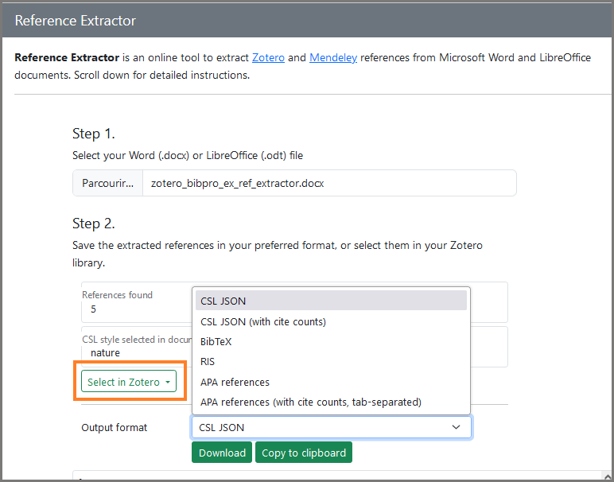

### 4.2 Rappels sur les exports de données de Zotero : formats CSV, etc.

De même qu'il prend en charge de nombreux formats d'import, Zotero propose de multiples format d'export. Outre les formats bibliographiques, il propose également un export CSV.

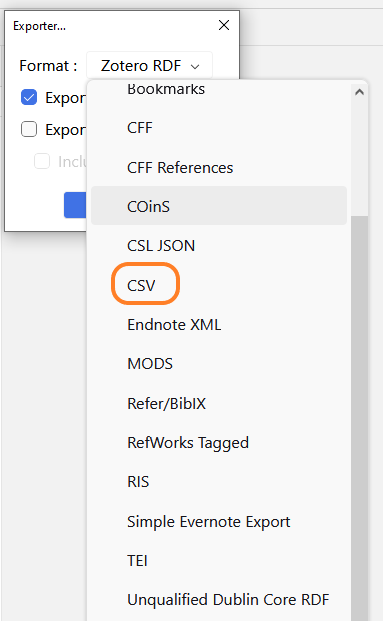

#### Créer un format d'export CSV personnalisé

Dans l’export CSV, tous les champs de vos références bibliographiques sont exportés par défaut, selon un ordre déterminé. Il est bien sûr possible de personnaliser tant les champs exportés que leur ordre, en modifiant le paramétrage du convertisseur que Zotero utilise pour cet export.

Nous prenons **10 minutes** pour créer un format d'export personnalisé CSV répondant au modèle suivant. Le fichier d'export doit comporter dans l'ordre indiqué uniquement ces données :

* les auteurs,
* le titre,
* l'année de publication,
* l'ISBN,
* le DOI,
* le contenu du champ `Extra`.

Vous trouverez comment procéder dans la documentation Zotero francophone, à la page indiquée ci-dessous.

![zotero][zotero] [Base de connaissance Zotero-FR : Créer un format d'export CSV personnalisé](https://docs.zotero-fr.org/kbfr/kbfr_export_csv_custom/)

**Crédits**

<a rel="license" href="https://creativecommons.org/licenses/by-sa/4.0/deed.en"></a><br />Les supports sont mis à disposition selon les termes de la <a rel="license" href="https://creativecommons.org/licenses/by-sa/4.0/deed.en">Licence Creative Commons Attribution - Partage dans les mêmes conditions 4.0 International Deed</a>.

[zotero]: img/icone_zotero.png

**Auteur**

Frédérique Flamerie
