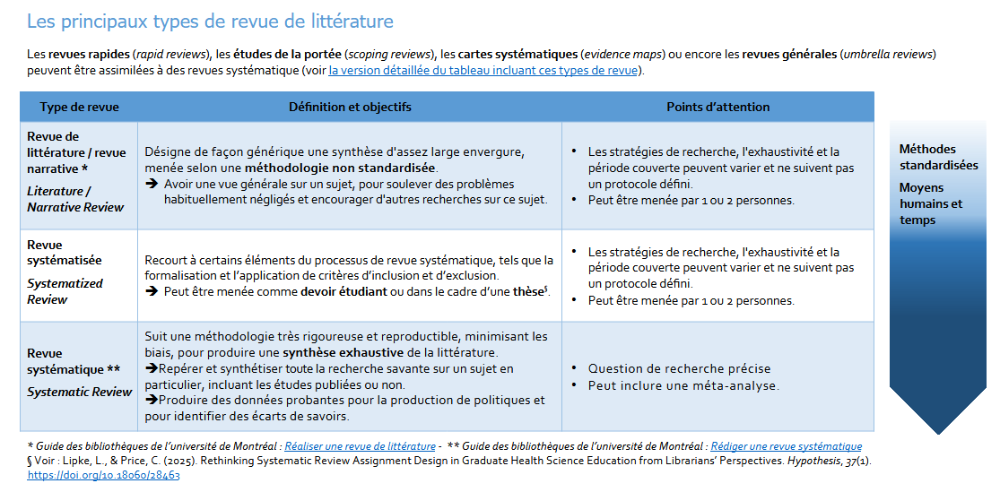
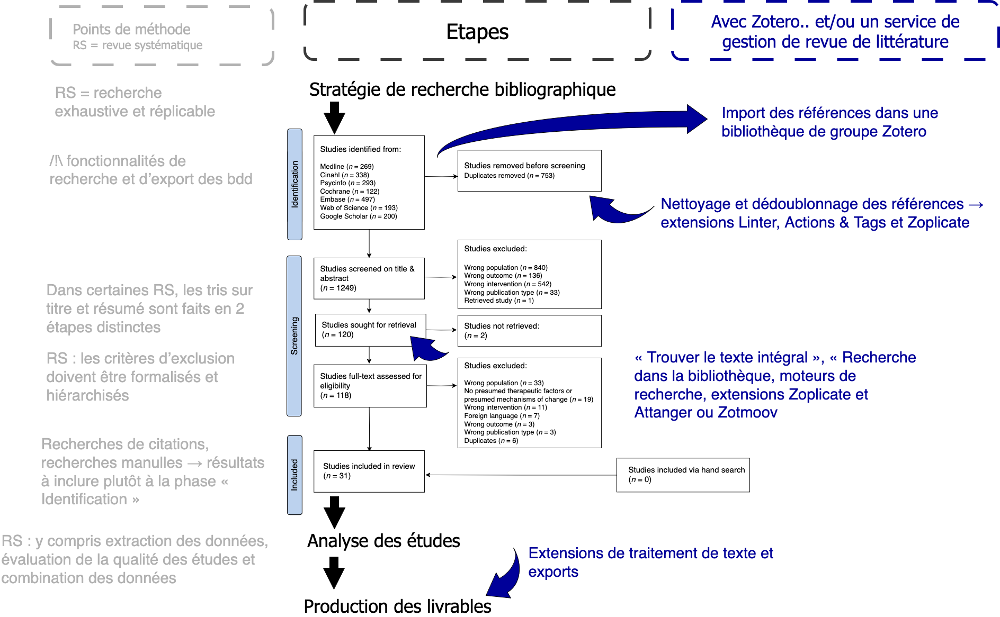
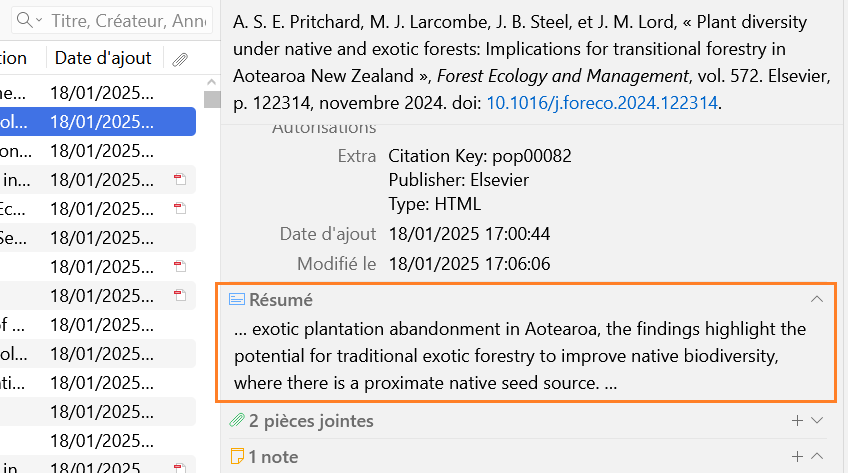
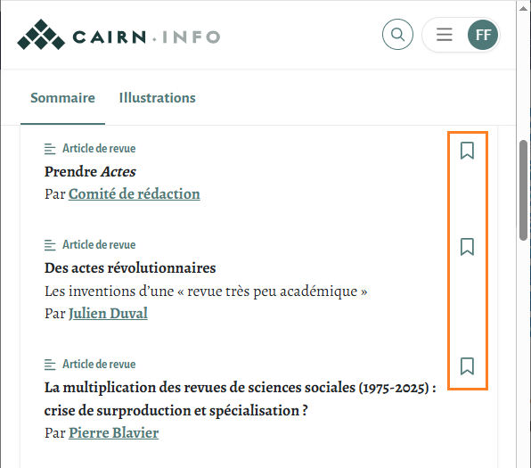
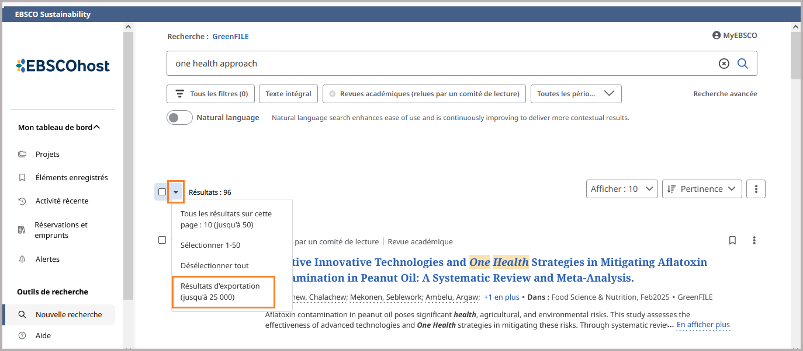
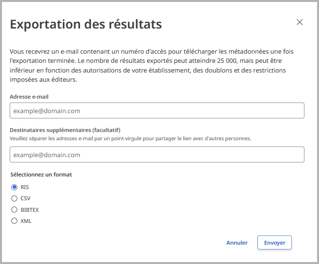
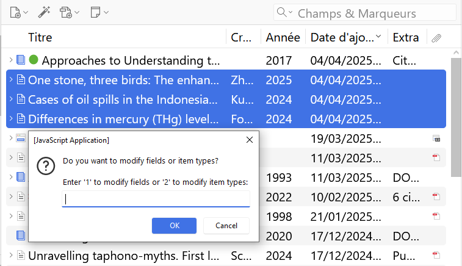
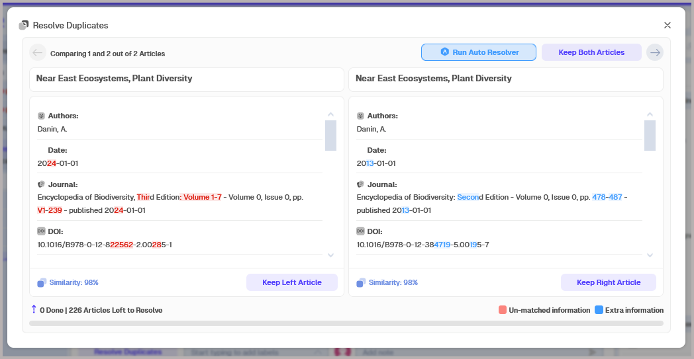
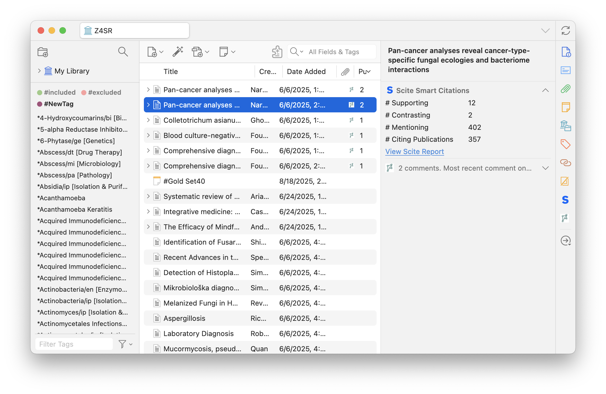

# Zotero pour les revues de littérature

## Objectifs

* Créer et organiser une bibliothèque Zotero dédiée pour une revue de littérature
* Tirer parti des fonctionnalités de Zotero et de ses extensions à toutes les étapes d’une revue de littérature, de l’import par lot des références bibliographiques à l’analyse du corpus et à la restitution des résultats

## Sommaire

0. Tour de table 
1. Introduction sur les revues de littérature 
2. Le flux de travail bibliographique d'une revue de littérature avec Zotero : créer une bibliothèque et importer les données
3. Le flux de travail bibliographique d'une revue de littérature avec Zotero : nettoyer et dédoublonner les références
4. Le flux de travail bibliographique d'une revue de littérature avec Zotero : organiser sa bibliothèque et trouver le texte intégral
5. Les outils de Zotero au service du travail d’analyse d’une revue de littérature
6. Rendre compte des résultats d’une revue de littérature

## 0. Tour de table

1. A quelle université ou organisation appartenez-vous? Quel est votre domaine de recherche?
2. Quelles sont vos attentes pour le stage?

## 1. Introduction sur les revues de littérature 

Une revue de littérature peut prendre plusieurs formes, selon le cadre de la recherche et le livrable attendu. Dans ce spectre, il est possible de naviguer entre différentes options, de la revue narrative à la revue systématique, comme le montre le tableau non exhaustif ci-dessous.



[Télécharger le tableau en ligne au format PDF aux dimensions A4](https://github.com/fflamerie/intro_revlit/blob/main/docs/Typologie_RevLit.pdf)

Dans tous les cas, y compris pour une synthèse de littérature menée dans le cadre d’un travail universitaire, Zotero peut grandement faciliter la réalisation de votre revue, accompagnant votre méthodologie quel que soit le degré d’exhaustivité que vous souhaitez ou devez atteindre.



## 2. Le flux de travail bibliographique d'une revue de littérature avec Zotero : créer une bibliothèque et importer les données

### Créer une bibliothèque de groupe

Même si vous travaillez seul, il est préférable de créer une bibliothèque de groupe pour votre revue de littérature, cela facilitera notamment **la gestion des doublons**. La recherche de doublons s'exécute en effet toujours sur tout le contenu d'une bibliothèque, il n'est pas possible de la lancer seulement sur une partie de votre bibliothèque (une collection par exemple).

Le groupe Zotero consiste de plus en un **espace à part** distinct de votre bibliothèque personnelle : lorsque vous ajoutez un document depuis votre bibliothèque personnelle dans une bibliothèque de groupe, il est copié de votre bibliothèque vers cette bibliothèque de groupe. Si vous modifiez ce même document dans votre bibliothèque personnelle, les modifications ne sont pas répercutées dans la bibliothèque de groupe, et inversement. Vous distinguez ainsi nettement votre travail bibliographique personnel courant du travail bibliographique effectué pour votre revue de littérature. Il est bien sûr possible d’enregistrer un document directement dans la bibliothèque de groupe, sans effectuer de détour par votre bibliothèque personnelle.

Le groupe Zotero permet par ailleurs de définir très précisément qui a le droit de consulter ou modifier la bibliothèque de groupe, grâce à la combinaison des paramétrages suivants.

* Le **type de groupe** : privé, public à participation restreinte ou public à participation ouverte
* Les **membres du groupe** : rôle de membre, d’administrateur ou de propriétaire
* Les **droits accordés sur la bibliothèque** : lecture de la bibliothèque, modification des documents de la bibliothèque, modification des fichiers

Vous pouvez ainsi être le seul contributeur d’un groupe dont la bibliothèque peut être consultée plus largement, par les membres du groupe ou par tout internaute.

![zotero][zotero] [Documentation Zotero : Les groupes Zotero](https://docs.zotero-fr.org/groups)

#### Points d'attention concernant la synchronisation et les groupes

* Le **quota de 300 Mo** d’espace de stockage gratuit sur le serveur Zotero concerne les **fichiers joints** et non les références bibliographiques, ni les notes et annotations : si vous ne synchronisez pas vos fichiers joints vous n’aurez aucun problème de dépassement de votre espace de stockage. Pour les bibliothèques de groupe, l'espace de stockage est décompté sur le quota du **propriétaire du groupe**.
* Le compte en ligne vous permet d’**enregistrer des documents directement dans votre bibliothèque en ligne**. Vous pouvez ainsi ajouter des documents dans votre bibliothèque Zotero même si Zotero n’est pas installé sur l’ordinateur que vous utilisez. Il faut en revanche que le connecteur Zotero soit installé dans le navigateur que vous utilisez, ou que vous ayez recours à l'ajout par identifiant.
* Vous retrouvez dans votre bibliothèque en ligne une petite partie des fonctionnalités de votre bibliothèque locale. A noter que l'application locale est indispensable pour l'interaction avec **les extensions de traitement de texte**.

![zotero][zotero] [Documentation Zotero : Est-ce que la bibliothèque en ligne est identique à l’application de bureau Zotero ?](https://docs.zotero-fr.org/kb/web_vs_desktop)
 
* Si le droit de consulter la bibliothèque de groupe peut être accordé à tout internaute, **cette consultation est limitée aux références bibliographiques** : les fichiers joints demeurent toujours accessibles seulement aux membres du groupe.
* Veillez à **la bonne attribution des droits** en fonction de l’organisation souhaitée. Par exemple, si les droits des membres du groupe sont limités à la seule consultation de la bibliothèque, n’oubliez pas d’attribuer le rôle d’administrateur à toutes les personnes qui doivent ajouter des documents dans la bibliothèque ou les modifier.
* Pour faciliter l'ajout des membres du groupe au démarrage d'un projet, il est recommandé de créer un groupe de type **Public, à participation restreinte** plutôt qu'un groupe privé. L'initiative de rejoindre le groupe revient ainsi aux membres et non aux administrateurs du groupe, qui se voient épargnés la collecte des noms d'utilisateur Zotero ou des adresses de courriel pour l'envoi des invitations. Dans le cas d'un groupe destiné à devenir privé, il suffit alors de modifier ce paramètre lorsque tous les membres ont rejoint le groupe.
* Un **flux RSS** affiché sur la page de la bibliothèque en ligne du groupe permet de suivre les ajouts dans la bibliothèque. Il faut pour cela que le groupe soit public, et sa bibliothèque consultable par tous.

### Importer des lots de références dans Zotero

Recourir au connecteur de Zotero et cliquer sur le bouton "Save to Zotero" est la meilleure méthode pour enregistrer des documents dans votre bibliothèque au fil des recherches, lorsqu'il s'agit d'enregistrer un document après l'autre.

Dans le cadre d'une revue de littérature où vous devez enregistrer d'un seul coup depuis une base de données tous les résultats d'une équation de recherche, l'import de fichier est plus adapté, car beaucoup plus rapide.

Nous allons effectuer ensemble des tests sur quelques bases de données ou moteurs de recherche. La méthode peut être généralisée de la façon suivante.

1. Rechercher dans l'interface, sur la page d'une liste de résultats, une fonctionnalité intitulée _Save_, _Export_, _Downolad_ ou un équivalent du même registre.
2. Vérifier les **formats d'export disponibles** : s'il y en a plusieurs, effectuer des tests d'export et d'import dans Zotero pour chacun d'eux avec un lot restreint de résultats. Cela permet de sélectionner le format le plus adapté, c'est-à-dire qui à la fois soit pris en charge par Zotero et comporte les données les plus complètes et les mieux formatées. Dans PubMed par exemple, c'est le format **.nbib**.  
3. Anticiper dès cette étape les limitations qui pourraient ralentir ou compliquer votre travail, telles qu'un **nombre maximal de références par lot exporté**.
4. Anticiper les difficultés liées à la **qualité des données** autres que celles dues aux formats d'export.
    * Données **mal saisies sans solution alternative** : [exemple du champ "Prénom" de l'éditeur dans PsycInfo](https://zotero.hypotheses.org/5552#section2-4).
    * Données **lacunaires ou absentes** : exemple du résumé de Google Scholar : le résumé est en fait généralement un extrait.



#### Importer par lot : exemples pratiques 

📝 Effectuez une recherche ramenant au moins 100 résultats dans chacun des outils de recherche bibliographiques ci-dessous. Quelle est la meilleure méthode d'export, pour importer tous les résultats de votre recherche dans Zotero?

1. **[GreenFile](http://www.greeninfoonline.com/)** : si votre université est abonnée à une base de données sur EBSCOHost, vous pouvez procéder au test sur cette base de données plutôt que sur GreenFile.
2. **[CAIRN Info](https://shs.cairn.info/?lang=fr)**
3. **[CORE](https://core.ac.uk/)**

<details style="text-indent: 4em">
<summary>Réponses</summary>

* CORE → fichier CSV très pauvre et mal construit : espérer qu'il y ait beaucoup de références avec DOI 😅
* CAIRN info → au moins 2 clics par référence, nécessaire d'ajouter chacune à l'unité dans une liste de lecture avant d'exporter cette dernière

 
  
* GreenFile ou une autre base disponible via EBSCOHost → cf. copies d'écran avec GreenFile ci-dessous : l'envoi du fichier d'export par courriel n'est pas toujours activé en fonction des établissements.
    * EBSCOHost : l'option permettant d'exporter jusqu'à 25'000 références d'un coup est affichée sur la liste de résultats.
      
  
  
    * EBSCOHost : le fichier de références est envoyé par courriel, au format RIS, CSV, BIBTEX ou XML.
      
  

</details>

#### Google Scholar : le détour par Publish or Perish

Parmi les nombreuses limitations imposées par Google Scholar, figurent celle du nombre de résultats affichés et exportables, et celle des fréquents refus de service pour usage abusif.

L'utilisation combinée du logiciel **[Publish or Perish](https://harzing.com/resources/publish-or-perish)** et d'un **VPN** permettent de contourner en partie ces obstacles et d'exporter d'un seul coup jusqu'à 1'000 résultats, dans divers formats y compris les formats RIS et BibTex.


Notez que Publish or Perish permet d'interroger d'autres sources, y compris des sources soumises à abonnement comme **Scopus**. Pour Scopus l'interrogation est gratuite jusqu'à 200 références et nécessite de disposer d'un compte gratuit Elsevier.

## 3. Le flux de travail bibliographique d'une revue de littérature avec Zotero : nettoyer et dédoublonner les références 

Une fois les références importées dans votre bibliothèque Zotero, les étapes suivantes consistent à :

* **nettoyer** ces références pour mettre à niveau voire compléter _a minima_ les informations bibliographiques,
* **dédoublonner** ces références.

Effectuer un nettoyage minimal avant le dédoublonnage améliorera la détection automatique des doublons.

📝 Pour mesurer les apports des différentes extensions que nous allons voir ensemble, nous allons travailler sur une base test de 40 références. Importez [le fichier de cette base au format Zotero RDF](https://raw.githubusercontent.com/fflamerie/zotero_revlit/main/docs/zotero_RevLit_IMPORT.rdf) dans votre bibliothèque Zotero. 

🤔 Quel est votre diagnostic? Combien de doublons repérez-vous? Quelles sont les informations bibliographiques à corriger?

🛠️ Téléchargez et installez les extensions que nous allons voir au cours de la formation.

* [Linter](https://github.com/northword/zotero-format-metadata)
* [Actions & Tags](https://github.com/windingwind/zotero-actions-tags)
* [Zoplicate](https://github.com/ChenglongMa/zoplicate)

La procédure d'installation d'une extension est détaillée dans la base de connaissance en français de Zotero. 

![zotero][zotero] [KBFR Zotero : Les extensions de Zotero > Installer et configurer une extension](https://docs.zotero-fr.org/kbfr/kbfr_extensions/#installer-et-configurer-une-extension)


### Nettoyer et compléter les informations bibliographiques avec l'extension Linter

A l'instar des bouloches qui témoignent de l'usure d'un vêtement, les multiples petites imperfections que Linter corrige viennent ternir l'aspect de votre bibliothèque Zotero.

![zotero][zotero] [KBFR Zotero : Extension Linter](https://docs.zotero-fr.org/kbfr/kbfr_linter/)

### Mettre à niveau les informations bibliographiques et organiser son flux de travail avec l'extension Actions & Tags

Actions & Tags vous permet d'optimiser votre organisation et votre flux de travail, en définissant des actions déclenchées automatiquement et/ou manuellement. 

![zotero][zotero] [KBFR Zotero : Extension Actions & Tags](https://docs.zotero-fr.org/kbfr/kbfr_actions_tags/)

#### Créer une action simple

📝 Nous allons créer une action personnalisée simple, c'est-à-dire en utilisant essentiellement les menus déroulants pour effectuer la configuration.

 👉 On souhaite ajouter automatiquement au document un marqueur `_lu et annoté` quand une note fille est créée.

#### Utiliser un script personnalisé 

📝 Installons ensemble le script personnalisé [Bulk Edit Multiple Items](https://github.com/windingwind/zotero-actions-tags/discussions/343). 

Première fenêtre de dialogue du script "Bulk Edit Multiple Items"


#### Quelques scripts personnalisés utiles pour une revue de littérature

* [Collection Tags](https://github.com/windingwind/zotero-actions-tags/discussions/245) pour créer et associer automatiquement aux références les marqueurs correspondant à leurs collections
* [Batch Tag Operations](https://github.com/windingwind/zotero-actions-tags/discussions/351) pour effectuer sur tout ou partie des marqueurs des opérations telles que combiner, scinder, retirer, préfixer ou suffixer, etc. 
* [Backup Attachment(s)](https://github.com/windingwind/zotero-actions-tags/discussions/347) pour créer une copie de sauvegarde des fichiers PDF joints aux références

### Gérer les doublons avec l'extension Zoplicate

Lorsque vous affichez les doublons potentiels repérés par Zotero en cliquant sur la vue "Doublons", vous devez ensuite valider individuellement chaque doublon pour fusionner les enregistrements concurrents. Ce fonctionnement est optimal pour **éviter les faux positifs**, c'est-à-dire pour éviter de fusionner des documents proposés comme doublons potentiels mais qui ne sont pas des doublons. Cela peut toutefois être pénalisant à certaines étapes d'une revue de littérature, lorsque ce risque de faux positif est nul. L'extension [Zoplicate](https://github.com/ChenglongMa/zoplicate) permet de fusionner les doublons par lot, et d'améliorer [la gestion des doublons](https://docs.zotero-fr.org/duplicate_detection/) à différents égards. Voici ses principales fonctionnalités.

* La **détection des doublons à l'import** et le choix de l'action à appliquer.
* La **fusion par lot** des doublons et le paramétrage de la référence à considérer comme document maître.
* L'affichage du **nombre de doublons** dans le volet de gauche de Zotero.
* Le marquage des faux positifs comme **non doublons**.

![zotero][zotero] [KBFR Zotero : Extension Zoplicate](https://docs.zotero-fr.org/kbfr/kbfr_zoplicate/)


#### Dédoublonnage : Zotero vs autres options gratuites

Les versions gratuites des services de gestion de revue de littérature en ligne offrent des performances très limitées pour le dédoublonnage.

* [Rayyan](https://www.rayyan.ai/) (version gratuite) : repérage peu précis, pas de fusion par lot



* [PICO Portal](https://picoportal.org/) (version gratuite) : peu d'outils d'aide à la décision, repérage peu précis, pas de fusion par lot


## 4. Le flux de travail bibliographique d'une revue de littérature avec Zotero : organiser sa bibliothèque et trouver le texte intégral 
### Organiser sa bibliothèque avec les marqueurs et les recherches enregistrées
Zotero dispose de plusieurs outils pour organiser une bibliothèque :

* les **collections** -> plus ou moins des dossiers, plutôt des listes de lecture,
* les **marqueurs** -> des mots-clés,
* les **recherches enregistrées** -> des collections dynamiques,
* les **liens connexes** -> pour lier entre eux des documents selon les critères qui font sens pour vous,
* les **notes** -> indexées par le moteur de recherche de Zotero, saisies dans un éditeur html permettant une mise en forme et/ou créées à partir des annotations de PDF.


Pourquoi privilégier les marqueurs plutôt que les collections?

On peut avancer 3 raisons principales.

* **Lisibilité** : grâce aux **marqueurs colorés** vous visualisez rapidement tous les documents associés à un marqueur. Vous pouvez de plus facilement **filtrer** vos marqueurs dans le sélecteur de marqueurs. Cela autorise à en créer beaucoup sans risque de confusion : vous pouvez envisager de recourir à un système de marqueurs pour suivre vos décisions d'exclusion, en indiquant également le stade et le motif, par exemple **_EXCLU_TitAbs_C1** pour un article exclu au stade du tri sur titre/résumé, sur le premier critère d'exclusion.
* **Portabilité** : les marqueurs font partie des informations bibliographiques du document et sont ainsi, par exemple, exportés au même titre que toutes les autres informations bibliographiques lorsque vous exportez des documents dans un fichier au format .ris, . csv, etc. Les collections et les recherches enregistrées relèvent en revanche de **l'interface** de votre bibliothèque, l'information du classement dans une collection n'est pas enregistrée en tant qu'information bibliographique du document.
* **Gestion automatisée** : grâce aux scripts d'Actions & Tags mentionnés ci-dessous, on peut facilement gérer une quantité importante de marqueurs, les scinder, les supprimer de façon globale ou sélective, etc. [L'extension Zutilo](https://github.com/wshanks/Zutilo/blob/master/i18n/fr/readme/docs/COMMANDS.md) permet quant à elle de copier tous les marqueurs associés à une référence et de les coller vers une ou plusieurs références.

#### Conserver ou non les marqueurs enregistrés automatiquement?

Par défaut, Zotero enregistre automatiquement les mots-clés associés au document dans la base à partir de laquelle vous l'avez enregistré : indexation Rameau dans le Sudoc, mots-clés auteur dans les sites d'éditeur et les bases de données bibliographiques, indexation contrôlée dans les bases de données bibliographiques. Tous ces termes hétérogènes accumulés peuvent finir par produire une liste de termes redondants (synonymes, variantes diverses d'un même mot) difficile à exploiter, et qui vient parasiter votre liste de marqueurs personnels.

Vous pouvez désactiver cet enregistrement depuis les _Paramètres_ > _Général_ > _Divers_ > _Ajouter automatiquement aux documents des marqueurs à partir des mots-clés fournis_.

Notez toutefois que même en décochant cette case vous enregistrerez toujours les mots-clés associés lorsque vous ajoutez des documents via un **import de fichier** et non via le navigateur. Décocher cette case ne désactive pas l'import du champ _keywords_ (ou équivalent) présent dans un fichier bibliographique. Il y a donc de fortes chances que vous retrouviez tout de même des marqueurs ajoutés automatiquement dans votre bibliothèque. Par ailleurs, il est parfois utile de se référer aux mots-clés auteurs ou aux indexations contrôlées d'une base de données.

Pour conserver une liste de marqueurs personnels propre, facile à exploiter et bien distincte des marqueurs ajoutés automatiquement, la meilleure option est par conséquent de **préfixer** ses marqueurs personnels au moyen d'un signe typographique tel que le tiret bas `_`. Vos marqueurs personnels seront ainsi non seulement facilement identifiables, mais toujours présentés en premier dans le sélecteur de marqueurs.

#### Les recherches sauvegardées pour automatiser l'organisation

💡 **Laissez Zotero travailler pour vous**

N'oubliez pas que le classement dans les collections, l'ajout de marqueurs, etc. nécessitent une saisie manuelle et prennent du temps. **Les recherches sauvegardées** sont un excellent moyen de gagner du temps et de l'efficacité, en utilisant automatiquement les informations que vous avez récupérées et celles que vous avez ajoutées pour chaque document.

Les recherches sauvegardées prennent en charge une syntaxe relativement riche.
Pour retrouver toutes les références pour lesquelles un champ est vide, par exemple les références sans résumé, il suffit de créer une recherche sur le modèle suivant :

```
Résumé -- Ne contient pas -- %
```

### Optimiser la recherche du texte intégral

Zotero dispose de fonctionnalités par défaut pour rechercher et enregistrer automatiquement le texte intégral, telles que les suivantes.

![zotero][zotero] [KBFR Zotero : Trouver des fichiers PDF de texte intégral avec Zotero](https://docs.zotero-fr.org/kbfr/kbfr_texte_integral/)


#### Installer un fichier de moteurs de recherche préconfiguré

📝 Plusieurs fichiers de moteurs de recherche préconfigurés sont disponibles en annexe au billet du blog Zotero francophone précédemment cité, ils sont disponibles sur [le dépôt GitHub du blog](https://github.com/zfrancophone/zfrancophone-blog/tree/master/2020-05-moteurs) .

Choisissez celui qui vous semble le plus adapté à vos besoins et installez-le dans Zotero, en suivant les indications fournies.

ℹ️ Rappel : pour accéder à votre répertoire de données Zotero depuis les _Paramètres_ de Zotero, cliquez sur : _Avancé_ > _Fichiers et dossiers_ > _Ouvrir le répertoire de données_.

## 5. Les outils de Zotero au service du travail d’analyse d’une revue de littérature

### Enregistrer et gérer les liens de citation dans Zotero 

La recherche de citations, ou _snowballing_, fait partie des méthodes de recherche bibliographique utilisables pour une revue de littérature ; elle peut être requise. Cette recherche peut s'entendre dans les deux sens de citation, en amont et en aval, et porter par conséquent sur les références citées et/ou citantes.

L'export des références citées et citantes est intégrée dans les deux principaux index de citation commerciaux, **Scopus** et **Web of Science**. D'autres services, gratuits, exploitent cette méthode de recherche et peuvent permettre de mener ce type de recherche, voir la fiche [Constituer et explorer des corpus d’articles avec Connected Papers, Research Rabbit et Citation Chaser](https://github.com/fflamerie/intro_revlit/blob/main/docs/Fiche_ExploLit.pdf)
 ; nous nous en tenons ici à l'exemple de Citation Chaser.

#### Retrouver les références citées et citantes avec Citation Chaser
[Citation Chaser](https://estech.shinyapps.io/citationchaser/), développé et mis à disposition par des chercheurs en écologie, présente de nombreux avantages.

* Son utilisation est **libre et gratuite**.
* La base de données d'indexation des citations utilisée est la base de données non commerciale de **The Lens**, offrant une couverture plus large que celle de Scopus ou du Web of Science puisqu'elle combine les données notamment de Microsoft Academic, PubMed, CORE et Crossref.
* La recherche et l'export des références citées et citantes est très simple et rapide à effectuer, comme le montre les captures d'écran ci-dessous. Ces captures présentent le cas de la recherche à partir d'un seul article, toutefois il est possible de saisir en entrée **plusieurs articles**.

1.  L'onglet _Article input_ permet de charger les articles à considérer, à partir de la saisie d'un de leurs identifiants (PMID, DOI, etc. ), d'un fichier .csv ou d'un fichier .ris.


2.  Les onglets _References_ et _Citations_ permettent ensuite de rechercher et exporter au format .ris respectivement les références citées et les références citantes.


3. Les onglets _Analysis_ et _Network_ fournissent des fonctionnalités complémentaires d'analyse et de visualisation.

Haddaway, N. R., Grainger, M. J., Gray, C. T. 2021. citationchaser: An R package and Shiny app for forward and backward citations chasing in academic searching. doi: [10.5281/zenodo.4543513](https://doi.org/10.5281/zenodo.4543513)

#### Retrouver les références citantes et gérer les liens de citation avec l'extension Cita

Cita propose diverses fonctionnalités pour **référencer, gérer et visualiser les liens de citation**, notamment en lien avec Wikidata. Le développement initial de Cita a de fait été rendu possible par un financement de la fondation Wikimedia.

![zotero][zotero] [KBFR Zotero : Extension Cita](https://docs.zotero-fr.org/kbfr/kbfr_cita/)

### Annoter ses PDF avec Zotero

#### Le lecteur de PDF


Le **lecteur de PDF** intégré à partir de Zotero 6 prend en charge depuis Zotero 7 les fichiers **EPUB** et les **captures de pages web**. Il offre notamment les fonctionnalités suivantes. Notez que ces fonctionnalités se combinent à celles d'un puissant **éditeur de notes**.

* Ouvrir les fichiers soit dans la fenêtre principale de Zotero dans une interface à onglets, soit dans des fenêtres distinctes.
* Modifier les informations bibliographiques d’un document tout en visualisant le fichier associé.
* **Annoter** les fichiers avec des outils variés, parmi lesquels :
  * créer des annotations textuelles ou manuscrites (uniquement dans les fichiers PDF),
  * surligner et souligner avec 8 couleurs différentes,
  * extraire du texte et des images et les commenter.
* Intégrer systématiquement les **informations de citation**, y compris la page, à chaque annotation.
* **Ajouter les annotations dans des notes Zotero** : créer automatiquement une note à partir de toutes les annotations d'un fichier, ou ajouter des annotations provenant de différents fichiers à une même note.
* **Citer depuis les annotations** :  le nouveau bouton "Add Note" dans l'extension de traitement de texte insère le contenu d'une note Zotero et les citations associées.

#### Gestion des annotations

Les annotations créées dans le lecteur de fichiers de Zotero ne sont pas lisibles directement dans un lecteur de PDF externe. Elles ne sont en effet pas stockées dans le fichier PDF mais **dans votre base de données Zotero**.

Zotero peut **importer les annotations** effectuées dans un lecteur de PDF externe. Pour **exporter** de Zotero des PDF avec leurs annotations intégrées, procédez comme suit.

* Sélectionnez les PDF ou leur document parent dans votre bibliothèque Zotero.
* Dans la barre de menu de Zotero, choisissez l'option _Fichier_ > _Exporter les PDFs..._

Les annotations peuvent être organisées au travers de la bibliothèque grâce aux **marqueurs**. Les couleurs d'annotation permettent uniquement de filtrer les annotations d'un même fichier PDF.

Enfin, dans les **bibliothèques de groupe** les annotations de chaque contributeur sont identifiées et verrouillées : chacun ne peut modifier que ses propres annotations.


#### Ressources

![zotero][zotero] [Documentation Zotero : Le lecteur PDF et l'éditeur de notes de Zotero](https://docs.zotero-fr.org/pdf_reader)

![zotero][zotero] [Base de connaissance Zotero : Pourquoi Zotero stocke-t-il les annotations PDF dans sa base de données plutôt que dans le fichier PDF ?](https://docs.zotero-fr.org/kb/annotations_in_database)

📺 Vidéo de "La Boîte à outils des  historien·ne·s" :

Heimburger, F. (2022, avril 21). Découvrir Zotero 6 - Le lecteur de pdf et la prise de notes en vidéo. La boîte à outils des historien·ne·s. https://boiteaoutils.info/2022/04/decouvrir-zotero-6-le-lecteur-de-pdf-et-la-prise-de-notes-en-video/

### Services complémentaires 
Parmi les services complémentaires que peut vous offrir Zotero, on retient notamment les suivants, à l'appui d'une part du **suivi des citations reçues** et d'autre part du **repérage des articles frauduleux**.

#### Extensions Scite et Citation Counts Manager

Ces deux extensions permettent de suivre les citations reçues par un article et sont davantage complémentaires que concurrentes.

[Zotero 7 Citation Counts Manager Enhanced](https://github.com/FrLars21/ZoteroCitationCountsManager) offre le choix de la base de données source pour le comptage des citations [Crossref](https://www.crossref.org), [INSPIRE-HEP](https://inspirehep.net) ou [Semantic Scholar](https://www.semanticscholar.org) et affiche un nombre unique de citations, ce qui permet de trier rapidement les documents de la bibliothèque par ordre croissant ou décroissant de citations reçues.


[L'extension Scite](https://github.com/scitedotai/scite-zotero-plugin) reporte quant à elle les nuances de qualification effectuées par scite.ai, soit un classement des citations selon les 3 catégories suivantes :

* les citations **appuyant** les conclusions de la publication (_Supporting_),
* les citations **contredisant** les conclusions la publication (_Contrasting_),
* les citations **neutres** qui mentionnent simplement la publication (_Mentioning_).

Les informations de Scite s'affichent dans le panneau de droite de la bibliothèque.



#### Extension PubPeer et intégration Retraction Watch

[L'interaction avec Retraction Watch](https://zotero.hypotheses.org/2809) est intégrée dans Zotero et elle fonctionne sans qu'aucune installation complémentaire ne soit nécessaire. Elle vous signale les articles rétractés non seulement dans votre bibliothèque Zotero, mais également dans votre traitement de texte, par un avertissement de l'extension de traitement de texte Zotero si l'article que vous vous apprêtez à citer a été rétracté.


En complément de cette interaction, [l'extension PubPeer](https://github.com/PubPeerFoundation/pubpeer_zotero_plugin) affiche dans le volet central de Zotero le nombre de commentaires PubPeer reçus, et davantage de détails dans une rubrique dédiée du volet de droite.


## 6. Rendre compte des résultats d’une revue de littérature
### Rappels sur les styles bibliographiques et la rédaction bibliographique

👉 Voir le support du stage [Gérer facilement sa bibliographie avec Zotero > Identifier et installer dans Zotero les styles bibliographiques de référence de son domaine](https://github.com/fflamerie/zotero_gerer_biblio/blob/master/content/gerer_biblio_zotero_COURS.md#5-identifier-et-installer-dans-zotero-les-styles-bibliographiques-de-r%C3%A9f%C3%A9rence-de-son-domaine)

#### Modifier un style

Parmi tous les styles disponibles aucun ne convient précisément au rendu que vous souhaitez ou devez obtenir?

Modifier un style bibliographique Zotero, écrit dans le langage informatique CSL, est plus ou moins trivial. Il est ainsi très simple de **classer les références par type de document dans la bibliographie**, vous trouverez comment procéder dans [la section "Créer une bibliographie par type de document" de cet atelier CSL](https://github.com/fflamerie/zotero_csl_libreABC/blob/main/docs/CSL_cours.md#cr%C3%A9er-une-bibliographie-par-type-de-document). Il est en revanche généralement beaucoup plus complexe de modifier l'ordre des informations bibliographiques ou d'en ajouter de nouvelles.

Deux billets du blog Zotero francophone pourront vous aider si vous souhaitez vous lancer dans l'aventure CSL.

- [Apporter de petites modifications à un style bibliographique](https://zotero.hypotheses.org/3746)
- [Bonnes pratiques pour la création d'un style CSL](https://zotero.hypotheses.org/5302)

#### Citer avec Zotero : les extensions de traitement de texte et les autres outils

Zotero dispose de différents outils pour générer des listes bibliographiques, qu'il s'agisse de produire [un rapport](https://docs.zotero-fr.org/reports), une [bibliographie indépendante](https://docs.zotero-fr.org/creating_bibliographies/#menu-contextuel-pour-creer-une-citationbibliographie) ou la liste récapitulative des références citées, ou encore qu'il s'agisse [d'insérer quelques références dans un courriel ou un diaporama](https://docs.zotero-fr.org/creating_bibliographies/#copie-rapide).

[Les extensions de traitement de texte](https://docs.zotero-fr.org/word_processor_integration/#les-extensions-pour-logiciel-de-traitement-de-texte) sont l'outil le plus adapté pour produire la liste récapitulative des références citées dans un texte. 

Il convient de souligner [les limitations de l'intégration Google Scholar](https://docs.zotero-fr.org/google_docs/#limitations), qui imposent une vigilance particulière si vous choisissez ce service pour la rédaction collaborative. Si la rédaction collaborative n'est pas une nécessité, alors il est préférable de recourir à un traitement de texte local pris en charge par Zotero.

#### Reference Extractor pour visualiser dans sa bibliothèque Zotero les documents cités dans un fichier de traitement de texte

 ![zotero][zotero] [KBFR Zotero : Comment visualiser dans sa bibliothèque Zotero les documents cités dans un fichier de traitement de texte?](https://docs.zotero-fr.org/kbfr/kbfr_docs_cites_refextractor/)

### Rappels sur les exports de données de Zotero : format CSV

De même qu'il prend en charge de nombreux formats d'import, Zotero propose de multiples format d'export. Outre les formats bibliographiques, il propose également un export CSV.


#### Créer un format d'export CSV personnalisé

Dans l’export CSV, tous les champs de vos références bibliographiques sont exportés par défaut, selon un ordre déterminé. Il est bien sûr possible de personnaliser tant les champs exportés que leur ordre, en modifiant le paramétrage du convertisseur que Zotero utilise pour cet export.

📝 Nous prenons **10 minutes** pour créer un format d'export personnalisé CSV répondant au modèle suivant. Le fichier d'export doit comporter dans l'ordre indiqué uniquement ces données :

* les auteurs,
* le titre,
* l'année de publication,
* l'ISBN,
* le DOI,
* le contenu du champ `Extra`.

Vous trouverez comment procéder dans la documentation Zotero francophone, à la page indiquée ci-dessous.

![zotero][zotero] [KBFR Zotero : Créer un format d'export CSV personnalisé](https://docs.zotero-fr.org/kbfr/kbfr_export_csv_custom/)

**Crédits**

<a rel="license" href="https://creativecommons.org/licenses/by-sa/4.0/deed.en"></a><br />Les supports sont mis à disposition selon les termes de la <a rel="license" href="https://creativecommons.org/licenses/by-sa/4.0/deed.en">Licence Creative Commons Attribution - Partage dans les mêmes conditions 4.0 International Deed</a>.

[zotero]: img/icone_zotero.png

**Auteur**

Frédérique Flamerie
