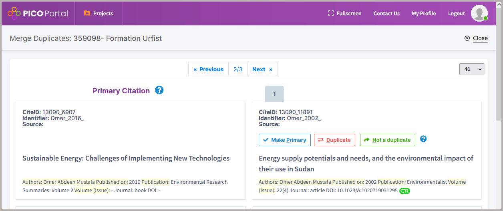

# Zotero pour les revues de littérature - supplément au stage du 2025-04-14

## Export des données depuis EBSCOhost

La plateforme EBSCOhost permet de générer un fichier d'export au format .RIS comportant jusqu'à 25'000 références. Ce fichier ne peut pas être téléchargé immédiatement, il est envoyé par courrier électronique dans un délai n'excédant généralement pas quelques minutes.

Les captures d'écran ci-dessous illustrent les deux étapes de cette procédure, à partir de la version gratuite de GreenFile accessible à l'adresse suivante : <http://www.greeninfoonline.com/>. Il est nécessaire de disposer d'un **compte gratuit MyEBSCO** pour utiliser cette fonctionnalité.

## Dédoublonnage

### Les services spécialisés pour revues de littérature

A titre d'exemple, les captures d'écran ci-dessous présentent les interfaces de fusion de doublons de deux services en ligne offrant une version gratuite relativement peu limitée, **Rayyan** et **PICO Portal** - pour plus de détails, voir la fiche [Logiciels spécialisés pour les revues de littérature](https://github.com/fflamerie/intro_revlit/blob/main/docs/Outils_RevLit.pdf).

La version gratuite de Rayyan ne permet pas la fusion des doublons par lot. Dans cette version gratuite, la détection des doublons est plus sensible que celle de Zotero : sur un même lot de plus de 13'000 références Rayyan propose 226 candidats doublons et Zotero 102. La paire ci-dessous identifiée comme doublon potentiel par Rayyan n'est pas détectée par Zotero comme doublon potentiel. 

PICO Portal ne dispose pas non plus de la fusion par lot, et l'interface de comparaison et de fusion des doublons offre peu d'aide à la décision.

### Bug temporaire de Zoplicate

Dans sa version actuelle v3.0.7, Zoplicate effectue bien la fusion des doublons, mais il ne conserve pas **le classement dans les collections** de la référence non retenue - voir le ticket dédié sur le dépôt GitHub de l'extension : [When merging duplicates, they are not kept in all collections but deleted](https://github.com/ChenglongMa/zoplicate/issues/158). Cela ne se produit pas avec la version v3.0.5. Dans l'attente de la résolution de ce bug, il est préférable le cas échéant d'installer et utiliser la version v3.0.5. Une solution de contournement consiste à utiliser le script [Collection Tags](https://github.com/windingwind/zotero-actions-tags/discussions/245) de l'extension [Actions & Tags](https://github.com/ChenglongMa/zoplicate). Ce script ajoute en effet automatiquement aux références des marqueurs correspondant aux collections dans lesquelles elles sont classées. 
